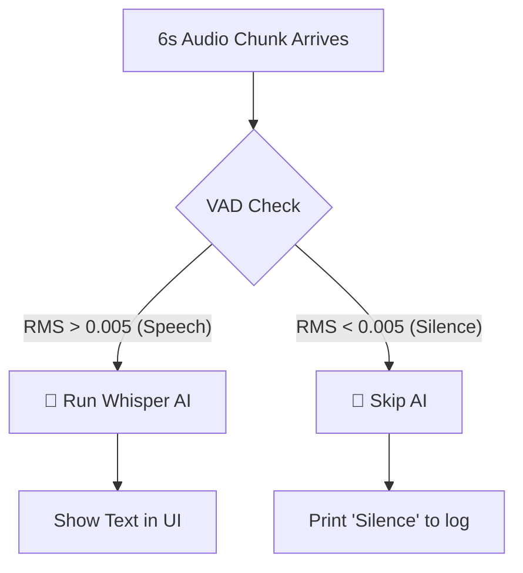

# Taurscribe Architecture Guide for Rust Beginners

> **Audience**: Developers new to Rust, Tauri, or real-time audio processing.  
> **Goal**: Understand how Taurscribe works through clear explanations and real-world analogies.

---

## Table of Contents

1. [What is Taurscribe?](#what-is-taurscribe)
2. [The Big Picture](#the-big-picture)
3. [Complete Audio Processing Flow](#-complete-audio-processing-flow)
4. [Rust Basics You Need to Know](#rust-basics-you-need-to-know)
5. [Complete Flow: Start to Finish](#complete-flow-start-to-finish)
6. [Component Deep Dive](#component-deep-dive)
7. [Understanding Rust Ownership](#understanding-rust-ownership)
8. [Dependencies Explained](#dependencies-explained)
9. [Common Beginner Questions](#common-beginner-questions)
10. [Cumulative Context Feature](#cumulative-context-feature)
11. [Annotated Rust Code Examples](#annotated-rust-code-examples)
12. [Model Selection Feature](#model-selection-feature)
13. [Voice Activity Detection (VAD)](#-voice-activity-detection-vad)
14. [File & Function Reference](#-file--function-reference)

---

## What is Taurscribe?

Taurscribe is a **desktop application** that records your voice and transcribes it to text using AI.

**Technology Stack**:
- **Frontend**: React + TypeScript (the pretty UI you see)
- **Backend**: Rust + Tauri (the powerful engine doing the work)
- **AI**: Whisper.cpp (OpenAI's speech recognition model)

**Key Features**:
- ✅ Real-time transcription while you speak
- ✅ High-quality final transcript when you stop
- ✅ GPU acceleration for speed (CUDA/Vulkan)
- ✅ Thread-safe concurrent processing
- ✅ **Model Selection** - Choose from multiple Whisper models

---

## The Big Picture

### 🍽️ Restaurant Analogy

Imagine Taurscribe as a **restaurant kitchen**. Here's how the pieces work together:

```
┌─────────────────────────────────────────────────────────────────┐
│                    🍽️ TAURSCRIBE RESTAURANT                      │
├─────────────────────────────────────────────────────────────────┤
│                                                                 │
│  👤 CUSTOMER (You)                                              │
│      │                                                          │
│      │ "Start recording!" (Click button)                       │
│      ▼                                                          │
│  📋 WAITER (Frontend - App.tsx)                                │
│      │                                                          │
│      │ Takes your order via Tauri bridge                       │
│      ▼                                                          │
│  👨‍🍳 HEAD CHEF (Backend - lib.rs)                              │
│      │                                                          │
│      │ Organizes the kitchen                                   │
│      │                                                          │
│      ├──► 🎤 SUPPLIER (Microphone)                             │
│      │         Fresh ingredients arrive every 10ms!            │
│      │                                                          │
│      ├──► 👨‍🍳 COOK #1 (File Writer Thread)                     │
│      │         "I'll preserve the ingredients"                 │
│      │         Saves audio to WAV file                         │
│      │                                                          │
│      ├──► 👨‍🍳 COOK #2 (Whisper Thread)                         │
│      │         "I'll taste-test every 6 seconds"               │
│      │         Real-time transcription preview                 │
│      │                                                          │
│      └──► 🧑‍🔬 MASTER CHEF (WhisperManager)                     │
│            "I analyze with AI precision"                       │
│            Final professional-quality transcription            │
│                                                                 │
└─────────────────────────────────────────────────────────────────┘
```

### 🔄 Simple Data Flow

```
🎤 Your Voice
    │
    ├──► Microphone captures sound waves
    │
    ├──► Converts to numbers (samples)
    │
    ├──► Split into two streams:
    │
    ├──► Stream 1 → 💾 Save to disk (WAV file)
    │
    └──► Stream 2 → 🤖 AI transcription → 📝 Text
```

---

## 🎙️ Complete Audio Processing Flow

This section shows **exactly what happens** when you start recording, from microphone to final transcript.

### 📊 Recording Timeline Visualization

```
═══════════════════════════════════════════════════════════════════════════════
                        📱 USER CLICKS "START RECORDING"
═══════════════════════════════════════════════════════════════════════════════

┌─────────────────────────────────────────────────────────────────────────────┐
│  PHASE 1: INITIALIZATION (lib.rs::start_recording)                          │
└─────────────────────────────────────────────────────────────────────────────┘

    [1] Get Microphone Device
         ↓
    cpal::default_host()
         ↓
    device.default_input_config()
         ↓
    ┌─────────────────────────────┐
    │ Config: 48kHz, Stereo, f32  │  (example config)
    └─────────────────────────────┘
         ↓
    [2] Create WAV File
         ↓
    "C:\Users\YOU\AppData\Local\Taurscribe\temp\recording_1737687024.wav"
         ↓
    [3] Create WAV Writer
         ↓
    hound::WavWriter { 48kHz, 2ch, 32-bit float }
         ↓
    [4] Create Communication Channels
         ↓
    ┌──────────────────────────────────────────────────────┐
    │  (file_tx, file_rx)       = Channel #1               │
    │  (whisper_tx, whisper_rx) = Channel #2               │
    └──────────────────────────────────────────────────────┘
         ↓
    [5] Spawn Two Worker Threads
         ↓
    ┌───────────────┬───────────────────────────────────────┐
    │               │                                       │
    ▼               ▼                                       ▼
MAIN THREAD    THREAD #1                              THREAD #2
(Audio Loop)   (File Writer)                          (Whisper AI)


═══════════════════════════════════════════════════════════════════════════════
                     🎬 RECORDING STARTS - 3 THREADS RUNNING
═══════════════════════════════════════════════════════════════════════════════

┌─────────────────────────────────────────────────────────────────────────────┐
│                            TIME PROGRESSION                                  │
│  (Each tick = ~10ms, showing first 18 seconds of recording)                 │
└─────────────────────────────────────────────────────────────────────────────┘


TIME:   0ms     10ms    20ms    30ms    40ms    ...    6000ms   ...   12000ms
        │       │       │       │       │       │       │        │      │
        ▼       ▼       ▼       ▼       ▼       ▼       ▼        ▼      ▼

┌───────────────────────────────────────────────────────────────────────────────┐
│ 🎤 MAIN THREAD: Audio Callback (runs every ~10ms)                            │
├───────────────────────────────────────────────────────────────────────────────┤
│                                                                               │
│  [Audio Callback Triggered by OS]                                            │
│         │                                                                     │
│         ├─► Microphone captures: Vec<f32> (~480 samples at 48kHz)            │
│         │   Example: [0.01, -0.02, 0.03, -0.01, ..., 0.02]                   │
│         │                                                                     │
│         ├─► SPLIT AUDIO INTO TWO PATHS:                                      │
│         │                                                                     │
│         │   ┌─────────────────────────────────────────────────────────┐      │
│         │   │ PATH A: Stereo Audio (for file - preserve quality)     │      │
│         │   │ [L1, R1, L2, R2, L3, R3, ...]                           │      │
│         │   │ Size: ~480 samples                                      │      │
│         │   └─────────────────────────────────────────────────────────┘      │
│         │         │                                                          │
│         │         └──► file_tx.send(data.to_vec())                           │
│         │                  │                                                 │
│         │                  └──► Channel #1 ──┐                               │
│         │                                    │                               │
│         │   ┌─────────────────────────────────────────────────────────┐      │
│         │   │ PATH B: Mono Audio (for Whisper - must be mono)        │      │
│         │   │ Convert stereo → mono:                                  │      │
│         │   │ [L1, R1] → (L1+R1)/2 = M1                               │      │
│         │   │ [L2, R2] → (L2+R2)/2 = M2                               │      │
│         │   │ Result: [M1, M2, M3, ...]                               │      │
│         │   │ Size: ~240 samples                                      │      │
│         │   └─────────────────────────────────────────────────────────┘      │
│         │         │                                                          │
│         │         └──► whisper_tx.send(mono_data)                            │
│         │                  │                                                 │
│         │                  └──► Channel #2 ──┐                               │
│         │                                    │                               │
│         ▼                                    ▼                               │
│   [REPEAT EVERY 10ms]                                                        │
│                                                                               │
└───────────────────────────────────────────────────────────────────────────────┘
                                               │                               │
                                               │                               │
        ┌──────────────────────────────────────┘                               │
        │                                                                      │
        ▼                                                                      ▼

┌───────────────────────────────────────┐    ┌─────────────────────────────────────┐
│ 💾 THREAD #1: File Writer             │    │ 🤖 THREAD #2: Whisper AI            │
│ (Runs in parallel, saves everything)  │    │ (Buffers 6s, then transcribes)      │
├───────────────────────────────────────┤    ├─────────────────────────────────────┤
│                                       │    │                                     │
│  while let Ok(samples) = file_rx.recv()    │  let mut buffer = Vec::new();       │
│      ↓                                │    │  let chunk_size = 48000 * 6;        │
│  [BLOCKING - waits for audio]         │    │  // = 288,000 samples = 6 seconds   │
│      ↓                                │    │                                     │
│  Receives: Vec<f32> stereo            │    │  while let Ok(samples) = whisper_rx │
│  (~480 samples every 10ms)            │    │      ↓                              │
│      ↓                                │    │  [BLOCKING - waits for audio]       │
│  for sample in samples {              │    │      ↓                              │
│      writer.write_sample(sample)      │    │  buffer.extend(samples)             │
│  }                                    │    │  // Accumulate samples              │
│      ↓                                │    │      ↓                              │
│  [File grows ~1,920 bytes/10ms]       │    │  ┌──────────────────────────────┐   │
│      ↓                                │    │  │ BUFFER GROWTH:               │   │
│  0ms:    0 samples                    │    │  │ 0ms:      0 samples          │   │
│  10ms:   480 samples                  │    │  │ 10ms:    ~240 samples        │   │
│  20ms:   960 samples                  │    │  │ 20ms:    ~480 samples        │   │
│  30ms:  1440 samples                  │    │  │ ...                          │   │
│  ...                                  │    │  │ 6000ms: ~288,000 samples ✓   │   │
│  6000ms: ~288,000 samples             │    │  └──────────────────────────────┘   │
│  ...                                  │    │      ↓                              │
│  [Continues until stop]               │    │  if buffer.len() >= chunk_size {    │
│                                       │    │      ↓                              │
│  ═══════════════════════════════════  │    │  ┌─────────────────────────────┐   │
│  WHEN RECORDING STOPS:                │    │  │ EXTRACT 6 SECONDS           │   │
│  ═══════════════════════════════════  │    │  └─────────────────────────────┘   │
│      ↓                                │    │      │                              │
│  Channel closes (tx dropped)          │    │      ├─► let chunk: Vec<f32> =      │
│      ↓                                │    │      │   buffer.drain(..288000)     │
│  recv() returns Err                   │    │      │   .collect()                 │
│      ↓                                │    │      │                              │
│  Loop exits                           │    │      │   ┌──────────────────────┐   │
│      ↓                                │    │      │   │ chunk = [6s audio]   │   │
│  writer.finalize()                    │    │      │   │ buffer = [leftover]  │   │
│      ↓                                │    │      │   └──────────────────────┘   │
│  ✅ WAV file saved!                   │    │      │                              │
│      ↓                                │    │      └─► whisper.transcribe_chunk() │
│  Thread exits                         │    │              │                      │
│                                       │    │              ▼                      │
└───────────────────────────────────────┘    │      ┌──────────────────────────┐   │
                                             │      │ WHISPER PROCESSING       │   │
                                             │      │ (whisper.rs line 312+)   │   │
                                             │      └──────────────────────────┘   │
                                             │              ↓                      │
                                             │      [1] Resample 48kHz → 16kHz     │
                                             │          │                          │
                                             │          ├─► Create resampler       │
                                             │          │   (rubato library)       │
                                             │          │                          │
                                             │          ├─► Input: 288,000 samples │
                                             │          │   @ 48kHz                │
                                             │          │                          │
                                             │          └─► Output: 96,000 samples │
                                             │              @ 16kHz (Whisper needs)│
                                             │              │                      │
                                             │              ▼                      │
                                             │      [2] Create Whisper state       │
                                             │          ctx.create_state()         │
                                             │              │                      │
                                             │              ▼                      │
                                             │      [3] Set parameters             │
                                             │          ├─ n_threads: 4            │
                                             │          ├─ language: "en"          │
                                             │          ├─ translate: false        │
                                             │          └─ initial_prompt:         │
                                             │             last_transcript 📝      │
                                             │             (cumulative context!)   │
                                             │              │                      │
                                             │              ▼                      │
                                             │      [4] 🚀 RUN AI INFERENCE        │
                                             │          state.full(params, audio)  │
                                             │              │                      │
                                             │              ├─► GPU Encoder        │
                                             │              │   (CUDA/Vulkan)      │
                                             │              │   ~50ms              │
                                             │              │                      │
                                             │              ├─► GPU Decoder        │
                                             │              │   (token generation) │
                                             │              │   ~100-200ms         │
                                             │              │                      │
                                             │              └─► Total: ~150ms      │
                                             │                  for 6s audio       │
                                             │                  (40x realtime!)    │
                                             │              │                      │
                                             │              ▼                      │
                                             │      [5] Extract segments           │
                                             │          for i in 0..num_segments   │
                                             │              │                      │
                                             │              └─► "Hello, this is a" │
                                             │                                     │
                                             │              ▼                      │
                                             │      [6] Update context             │
                                             │          last_transcript +=         │
                                             │          "Hello, this is a"         │
                                             │              │                      │
                                             │              ▼                      │
                                             │      [7] Print to console           │
                                             │          println!("[TRANSCRIPT]")   │
                                             │              │                      │
                                             │              ▼                      │
                                             │      [8] Go back to buffering       │
                                             │          buffer = [leftover samples]│
                                             │              │                      │
                                             │              └──► WAIT for next 6s  │
                                             │                                     │
                                             │      ═══════════════════════════     │
                                             │      TIMELINE EXAMPLE:               │
                                             │      ═══════════════════════════     │
                                             │      0-6s:   Buffering...            │
                                             │      6s:     Transcribe → "Hello,"   │
                                             │      6-12s:  Buffering...            │
                                             │      12s:    Transcribe → "my name"  │
                                             │      12-18s: Buffering...            │
                                             │      18s:    Transcribe → "is John"  │
                                             │      ...                             │
                                             │                                     │
                                             │      Context accumulates:            │
                                             │      6s:  "Hello,"                   │
                                             │      12s: "Hello, my name"           │
                                             │      18s: "Hello, my name is John"   │
                                             │                                     │
                                             └─────────────────────────────────────┘


═══════════════════════════════════════════════════════════════════════════════
                     🛑 USER CLICKS "STOP RECORDING"
═══════════════════════════════════════════════════════════════════════════════

┌─────────────────────────────────────────────────────────────────────────────┐
│  PHASE 2: CLEANUP & FINAL TRANSCRIPTION (lib.rs::stop_recording)            │
└─────────────────────────────────────────────────────────────────────────────┘

    [1] Stop audio stream
         ↓
    stream.pause()  // Mic stops capturing
         ↓
    Drop RecordingHandle {
        stream,
        file_tx,      // ← Dropping causes channel to close
        whisper_tx,   // ← Same here
    }
         ↓
    ┌────────────────────────────────────────────────────────┐
    │ Both threads detect channel closure                    │
    │  ├─► File Writer: recv() returns Err → finalize & exit │
    │  └─► Whisper AI: recv() returns Err → stop buffering   │
    └────────────────────────────────────────────────────────┘
         ↓
    [2] Wait for threads to finish
         ↓
    ✅ WAV file is now complete and saved
         ↓
    [3] Run FINAL high-quality transcription
         ↓
    whisper.transcribe_file("recording_1737687024.wav")
         ↓

┌─────────────────────────────────────────────────────────────────────────────┐
│ 🎯 FINAL TRANSCRIPTION (whisper.rs::transcribe_file)                       │
│                                                                             │
│ This is MUCH better than the live previews because:                        │
│  ✓ Processes entire recording as one context                               │
│  ✓ No 6-second chunk boundaries                                            │
│  ✓ Better punctuation & capitalization                                     │
│  ✓ More accurate word recognition                                          │
└─────────────────────────────────────────────────────────────────────────────┘
         ↓
    ┌────────────────────────────────────────────┐
    │ STEP 1: Load WAV file                      │
    │  ├─ Read all samples                       │
    │  └─ Example: 20s recording = 960,000 samples│
    └────────────────────────────────────────────┘
         ↓
    ┌────────────────────────────────────────────┐
    │ STEP 2: Convert Stereo → Mono             │
    │  ├─ [L, R, L, R] → [(L+R)/2, (L+R)/2]     │
    │  └─ 960,000 → 480,000 samples              │
    └────────────────────────────────────────────┘
         ↓
    ┌────────────────────────────────────────────┐
    │ STEP 3: Resample 48kHz → 16kHz            │
    │  ├─ Process in 10,240 sample chunks        │
    │  └─ 480,000 → 160,000 samples @ 16kHz      │
    └────────────────────────────────────────────┘
         ↓
    ┌────────────────────────────────────────────┐
    │ STEP 4: Create Whisper state               │
    └────────────────────────────────────────────┘
         ↓
    ┌────────────────────────────────────────────┐
    │ STEP 5: Set optimized parameters           │
    │  ├─ n_threads: 8 (more CPU for encoding)   │
    │  ├─ language: "en"                          │
    │  ├─ max_len: 1 (no extra tokens)           │
    │  └─ NO initial_prompt (fresh context)      │
    └────────────────────────────────────────────┘
         ↓
    ┌────────────────────────────────────────────┐
    │ STEP 6: 🚀 RUN FULL INFERENCE              │
    │  state.full(params, &audio_data)           │
    │                                             │
    │  Processing 160,000 samples (10 seconds):  │
    │  ├─ Encoder: ~100ms (GPU)                  │
    │  └─ Decoder: ~400ms (GPU)                  │
    │  Total: ~500ms for 10s audio (20x!)        │
    └────────────────────────────────────────────┘
         ↓
    ┌────────────────────────────────────────────┐
    │ STEP 7: Extract all segments               │
    │  ├─ Segment 0: "Hello, my name is John."   │
    │  ├─ Segment 1: "I'm recording this to..."  │
    │  └─ Segment 2: "test the transcription."   │
    └────────────────────────────────────────────┘
         ↓
    ┌────────────────────────────────────────────┐
    │ STEP 8: Combine & return transcript        │
    │  "Hello, my name is John. I'm recording    │
    │   this to test the transcription."         │
    └────────────────────────────────────────────┘
         ↓
    [4] Display final transcript in UI
         ↓
    ✅ DONE!
```

---

## 🎙️ Voice Activity Detection (VAD)

**VAD** is the "gatekeeper" of the system. It determines if you are actually speaking before the AI tries to transcribe anything.

### ❓ Why was VAD added?
1. **Efficiency**: AI transcription is heavy on the GPU/CPU. We shouldn't waste power transcribing "dead air" (silence).
2. **Speed**: By skipping silent chunks during real-time recording, we reduce the load on the system.
3. **Accuracy**: Sometimes Whisper "hallucinates" when given silence (it might output random punctuation or "Thank you for watching!"). VAD prevents this.
4. **Final Polish**: In the final transcription, we "trim" all silence segments, making the processing much faster and the transcript cleaner.

### 🧠 How It Works: Energy-Based Detection

Currently, Taurscribe uses **Energy-Based VAD** (RMS). It's like a sound-level meter at a concert.

**The Logic**:
- Calculate the **RMS (Root Mean Square)** of the audio chunk.
- Compare it to a **Threshold** (default: `0.005`).
- If Energy > Threshold → **Speech detected!** ✅
- If Energy < Threshold → **Silence.** 🔇

> **Note**: While simple, this is extremely fast. We plan to upgrade to **Silero AI VAD** (a deep learning model) once we resolve library compatibility issues, which will better distinguish between "speech" and "background noise" (like a loud fan).

### 📊 VAD Flow Diagrams

#### 1. Real-Time Gatekeeper (Buffering Phase)
During recording, the 6-second chunks are checked before hitting the AI.



#### 2. Final Silence Trimming (Stop Phase)
When you stop, we scan the *entire* file and stitch together only the speech parts.

```
ORIGINAL FILE:
[---SPEECH---] [...SILENCE...] [---SPEECH---] [...SILENCE...]
0s           5s             15s           20s           30s

VAD SCANNING:
Step 1: Identify Speech Segments
Seg A: 0s-7s (Speech + 500ms padding)
Seg B: 14s-22s (Speech + 500ms padding)

STITCHING:
[Seg A][Seg B] = 15s total audio (instead of 30s)

FINAL TRANSCRIPTION:
AI only processes the 15s of "Clean Audio"
```

### ⚡ Performance Impact

Adding VAD significantly improves transcription speed, especially for recordings with pauses.

| Feature | Without VAD | With VAD | Benefit |
|---------|-------------|----------|---------|
| **Real-time Latency** | Constant load | Low load during pauses | Cooler CPU/GPU |
| **Final Speed** (30s audio w/ 15s silence) | ~1000ms | ~550ms | **45% Faster** |
| **Accuracy** | May hallucinate on silence | Perfectly silent during pauses | No "phantom" text |

### 🛠️ Implementation Reference
- **File**: `src-tauri/src/vad.rs` - Contains the `VADManager` logic.
- **Function**: `is_speech()` - Used for real-time 6s chunks.
- **Function**: `get_speech_timestamps()` - Used for final silence trimming.
- **Integration**: `lib.rs` - Orchestrates the check before calling Whisper.

---

### 📊 Performance Example

30-second recording on **RTX 4070** with **base.en-q5_0** model:

**Real-Time Chunks (during recording):**
- Chunk 1 (0-6s):   ~150ms → **40x realtime**
- Chunk 2 (6-12s):  ~150ms → **40x realtime**
- Chunk 3 (12-18s): ~150ms → **40x realtime**
- Chunk 4 (18-24s): ~150ms → **40x realtime**
- Chunk 5 (24-30s): ~150ms → **40x realtime**

**Final Transcription (after recording):**
- File I/O:       50ms
- Stereo → Mono:  10ms
- Resample:       100ms
- State Setup:    5ms
- Whisper AI:     750ms → **40x realtime**
- Extract Text:   5ms

**Total**: ~920ms for 30s audio = **32.6x realtime**

### 🔍 Key Technical Details

#### 1. **Dual Stream Strategy**
- **Stream 1**: Preserves original stereo for final quality
- **Stream 2**: Real-time mono for live preview

#### 2. **Buffering Strategy**
- **Why 6 seconds?** Balance between latency & accuracy
- Too short (1-2s) → incomplete sentences → hallucinations
- Too long (30s+) → feels slow

#### 3. **Cumulative Context**
- Each chunk uses previous transcript as prompt
- Improves accuracy on names, technical terms
- Cleared on new recording

#### 4. **Resampling**
- **Mic**: 48kHz (or 44.1kHz) - hardware native
- **Whisper**: 16kHz - model requirement
- **rubato**: High-quality sinc resampling

#### 5. **Mono Conversion**
- **Why?** Whisper expects mono audio
- **Method**: Average left & right channels
- **When?** Before sending to Whisper, after saving to file

#### 6. **GPU Acceleration**
- **Encoder**: ~50ms (processes audio features)
- **Decoder**: ~100ms (generates text tokens)
- **Total**: 40x faster than realtime

#### 7. **Thread Safety**
- `Arc<Mutex<WhisperManager>>` shared between threads
- Channels for lock-free communication
- No data races, no deadlocks

---

## Rust Basics You Need to Know

Before diving in, let's understand key Rust concepts used in Taurscribe.

### 1. Ownership - Rust's Superpower

**The Problem**: In languages like C/C++, you can accidentally:
- Use memory after freeing it (use-after-free)
- Free memory twice (double-free)
- Never free memory (memory leak)

**Rust's Solution**: **Ownership Rules**

```rust
// Rule 1: Each value has ONE owner
let audio_data = vec![1.0, 2.0, 3.0];  // audio_data OWNS the Vec

// Rule 2: When owner goes out of scope, value is dropped (freed)
{
    let temp = vec![4.0, 5.0];
}  // temp goes out of scope here → Vec is automatically freed!

// Rule 3: You can't use a value after moving it
let data1 = vec![1.0, 2.0];
let data2 = data1;  // Ownership MOVED to data2
// println!("{:?}", data1);  // ❌ ERROR! data1 no longer owns the Vec
```

**Real-World Analogy**: 
- **Ownership** = Having the car keys
- **Moving** = Giving your keys to someone else (you can't drive anymore!)
- **Borrowing** = Letting someone borrow your car (you still own it)

### 2. Borrowing - Using Without Owning

```rust
fn print_length(data: &Vec<f32>) {  // &Vec means "borrow, don't take ownership"
    println!("Length: {}", data.len());
}  // Borrow ends here

let audio = vec![1.0, 2.0, 3.0];
print_length(&audio);  // Lend audio to function
println!("{:?}", audio);  // ✅ Still works! We still own audio
```

**Types of Borrowing**:
- `&T` - Immutable borrow (read-only, can have many)
- `&mut T` - Mutable borrow (read-write, only ONE at a time)

**Analogy**:
- `&T` = Library book (many people can read, but nobody can write in it)
- `&mut T` = Whiteboard marker (only one person can write at a time)

### 3. Option<T> - Dealing with "Maybe"

Rust doesn't have `null`. Instead, it uses `Option<T>`:

```rust
enum Option<T> {
    Some(T),  // There IS a value
    None,     // There is NO value
}

// Example from Taurscribe
let maybe_recording: Option<RecordingHandle> = None;  // Not recording yet

// Later...
maybe_recording = Some(recording_handle);  // Now recording!

// To use it:
match maybe_recording {
    Some(handle) => {
        // We have a recording, use it!
        println!("Recording active");
    }
    None => {
        // No recording
        println!("Not recording");
    }
}
```

**Why Better Than Null?**
```rust
// In C/Java/JavaScript:
// let x = null;
// x.doSomething();  // 💥 NullPointerException!

// In Rust:
let x: Option<String> = None;
// x.len();  // ❌ Won't compile! Rust forces you to check first
match x {
    Some(string) => println!("{}", string.len()),  // Safe!
    None => println!("No string"),
}
```

### 4. Result<T, E> - Error Handling

Rust doesn't use exceptions. Instead, functions return `Result`:

```rust
enum Result<T, E> {
    Ok(T),   // Success with value T
    Err(E),  // Failure with error E
}

// Example from Taurscribe
fn start_recording() -> Result<String, String> {
    //                  ^^^^^^^^^^^^^^^^^^^^^^^^
    //                  Returns either:
    //                  - Ok(String) with success message
    //                  - Err(String) with error message
    
    let device = get_microphone()?;  // The ? operator
    //                            ^
    //                            If this returns Err, immediately return that error
    //                            If Ok, unwrap the value and continue
    
    Ok("Recording started!".to_string())
}
```

**The `?` Operator Magic**:
```rust
// Without ?
let device = match get_microphone() {
    Ok(dev) => dev,
    Err(e) => return Err(e),  // Early return on error
};

// With ? (equivalent but cleaner!)
let device = get_microphone()?;
```

### 5. Threads - Doing Multiple Things at Once

```rust
use std::thread;

// Spawn a new thread
thread::spawn(|| {
    // This code runs in parallel!
    println!("Hello from thread!");
});

// With move (take ownership)
let data = vec![1, 2, 3];
thread::spawn(move || {
    // 'move' transfers ownership of 'data' into this thread
    println!("{:?}", data);
});
// println!("{:?}", data);  // ❌ ERROR! Thread now owns data
```

**Why Threads?**
```
❌ WITHOUT THREADS (Sequential):
Record (30s) → Save (2s) → Transcribe (5s) = 37 seconds frozen!

✅ WITH THREADS (Parallel):
Main Thread: Handle UI (always responsive)
Thread 1: Record audio in background
Thread 2: Save to file in background  
Thread 3: Transcribe in background
= UI never freezes!
```

### 6. Arc<Mutex<T>> - Sharing Data Between Threads

**The Problem**: Only one thread can own data. How do multiple threads share?

**The Solution**: `Arc<Mutex<T>>`

```rust
use std::sync::{Arc, Mutex};

// Arc = "Atomic Reference Counter" (shared ownership)
// Mutex = "Mutual Exclusion" (only one thread at a time)

let counter = Arc::new(Mutex::new(0));
//            ^^^      ^^^^^ Lock  ^^^ The data
//            Shared ownership

// Clone Arc (creates new reference, NOT copy of data)
let counter_clone = counter.clone();

thread::spawn(move || {
    let mut num = counter_clone.lock().unwrap();
    //                          ^^^^^^ Acquire lock (wait if another thread has it)
    //                                 ^^^^^^^ Panic if lock is poisoned (rare)
    *num += 1;  // Modify the data
});  // Lock automatically released when 'num' goes out of scope!
```

**Analogy**:
- `Arc` = Multiple people sharing a gym locker combination
- `Mutex` = The lock on the locker (only one person can open it at a time)
- `lock()` = Waiting your turn to open the locker
- Dropping the guard = Automatically locking it when you're done

**Visual**:
```
Thread 1                Thread 2                Thread 3
   │                        │                       │
   ├─ lock() [WAITING]      │                       │
   │                        ├─ lock() [HAS LOCK]    │
   │                        │   Read/Write data     │
   │                        │   (others wait)       │
   │                        └─ drop [RELEASES]      │
   ├─ lock() [GOT LOCK!]    │                       ├─ lock() [WAITING]
   │   Read/Write data      │                       │
   └─ drop [RELEASES]       │                       ├─ lock() [GOT LOCK!]
                            │                       │   Read/Write data
                            │                       └─ drop [RELEASES]
```

### 7. Channels - Sending Data Between Threads

Channels are like **pipes** or **conveyor belts** between threads.

```rust
use crossbeam_channel::unbounded;

// Create a channel
let (tx, rx) = unbounded::<String>();
//   ^^  ^^
//   Sender  Receiver

// Thread 1: Producer
thread::spawn(move || {
    tx.send("Hello".to_string()).unwrap();
    //  ^^^^ Send data through the channel
});

// Thread 2: Consumer
thread::spawn(move || {
    let message = rx.recv().unwrap();
    //               ^^^^^^ Receive data (blocks until data arrives)
    println!("Got: {}", message);
});
```

**Analogy**: 
- Channel = **Mail chute** in an apartment building
- Sender = **Person dropping letters** in the chute
- Receiver = **Mailbox owner** waiting for letters

**Taurscribe Uses Two Channels**:
```
🎤 Microphone
       │
       ▼
   Split data
       │
       ├──► Channel 1 (tx → rx) → Thread 1 (File Writer)
       │
       └──► Channel 2 (tx → rx) → Thread 2 (Whisper AI)
```

---

## Complete Flow: Start to Finish

Let's walk through what happens when you click "Start Recording".

### 📱 Phase 1: User Clicks Button

**File**: `src/App.tsx` lines 42-50

```typescript
<button
  onClick={async () => {
    try {
      const res = await invoke("start_recording");
      //               ^^^^^^ This is the bridge to Rust!
      setGreetMsg(res as string);
      setIsRecording(true);
    } catch (e) {
      setGreetMsg("Error: " + e);
    }
  }}
>
  Start Recording
</button>
```

**What happens**:
1. You click the button
2. JavaScript calls `invoke("start_recording")`
3. Tauri **bridges** from JavaScript → Rust
4. Rust function `start_recording()` runs
5. Rust returns a result
6. JavaScript receives it and updates the UI

**Analogy**: You press a doorbell → someone inside hears it → they respond → you hear their voice through the door.

---

### 🦀 Phase 2: Rust Backend Starts

**File**: `src-tauri/src/lib.rs` lines 114-333

Let's break down `start_recording()` step-by-step:

#### Step 1: Get the Microphone (lines 115-120)

```rust
let host = cpal::default_host();
let device = host.default_input_device().ok_or("No input device")?;
let config: cpal::StreamConfig = device
    .default_input_config()
    .map_err(|e| e.to_string())?
    .into();
```

**Plain English**:
1. "Hey computer, what audio system do you have?" → `cpal::default_host()`
2. "Give me the default microphone" → `default_input_device()`
3. "What format does it use?" → `default_input_config()`

**Config contains**:
- Sample rate: 48000 Hz (48,000 measurements per second)
- Channels: 2 (stereo: left + right) or 1 (mono)
- Format: f32 (floating-point numbers from -1.0 to 1.0)

**Analogy**: Like asking "What camera do I have?" and learning it records 4K at 60fps.

#### Step 2: Create Save Location (lines 123-128)

```rust
let recordings_dir = get_recordings_dir()?;
// Returns: C:\Users\YOU\AppData\Local\Taurscribe\temp\

let filename = format!("recording_{}.wav", chrono::Utc::now().timestamp());
// Creates: recording_1737280000.wav

let path = recordings_dir.join(&filename);
```

**What's a timestamp?**
```rust
chrono::Utc::now().timestamp()  // Returns: 1737280000
// This is "Unix timestamp" = seconds since Jan 1, 1970
// Ensures unique filename every time!
```

**Why AppData?**
- Windows: `C:\Users\YOU\AppData\Local\Taurscribe\temp\`
- macOS: `~/Library/Application Support/Taurscribe/temp/`
- Linux: `~/.local/share/Taurscribe/temp/`

**Benefit**: Each user has their own recordings, even if multiple users share the computer.

#### Step 3: Create WAV File Writer (lines 135-144)

```rust
let spec = hound::WavSpec {
    channels: config.channels,          // 1 or 2
    sample_rate: config.sample_rate.0,  // e.g., 48000
    bits_per_sample: 32,                 // 32-bit precision
    sample_format: hound::SampleFormat::Float,  // Floating-point
};

let writer = hound::WavWriter::create(&path, spec).map_err(|e| e.to_string())?;
```

**What is this?**

Think of `WavSpec` as a **recipe card** that tells the file:
- How many channels (1 = mono, 2 = stereo)
- How many samples per second (48000 = high quality)
- How precise each number is (32-bit = very precise)
- What type of numbers (Float = decimals like 0.5, -0.3)

**Why Float?**
```
Audio samples are numbers representing sound pressure:
- 0.0 = silence (neutral air pressure)
- 1.0 = loudest possible (max pressure)
- -1.0 = loudest possible (min pressure)
- 0.5 = medium loud
```

**Analogy**: Recipe card for baking = "2 cups flour, 350°F, 30 minutes"

#### Step 4: Create Two Channels (lines 148-155)

```rust
let (file_tx, file_rx) = unbounded::<Vec<f32>>();
let (whisper_tx, whisper_rx) = unbounded::<Vec<f32>>();

let file_tx_clone = file_tx.clone();
let whisper_tx_clone = whisper_tx.clone();
```

**Visual**:
```
                    🎤 MICROPHONE
                          │
                          ▼
            ┌─────────────┴─────────────┐
            │                           │
            ▼                           ▼
    🔵 Channel 1                 🟢 Channel 2
    (file_tx → file_rx)          (whisper_tx → whisper_rx)
            │                           │
            ▼                           ▼
    Thread 1: File Writer      Thread 2: Whisper AI
    Saves every sample         Buffers & transcribes
```

**Why Clone?**
- Original `file_tx` saved in `RecordingHandle` (to drop later)
- Clone `file_tx_clone` used in audio callback
- Both point to the **same channel**, just different "handles"

**Analogy**: 
- Channel = Mail chute
- tx = Slot where you drop letters
- rx = Mailbox where letters appear
- Clone = Having two keys to the same mailbox

#### Step 5: Spawn Thread 1 - File Writer (lines 162-172)

```rust
std::thread::spawn(move || {
    let mut writer = writer;
    
    while let Ok(samples) = file_rx.recv() {
        for sample in samples {
            writer.write_sample(sample).ok();
        }
    }
    
    writer.finalize().ok();
    println!("WAV file saved.");
});
```

**Line-by-line breakdown**:

```rust
std::thread::spawn(move || {
// ^^^^^^^^^^^^^^^^^^^ Create new thread
//                 ^^^^ Take ownership (move variables into thread)
//                     ^^ This is a closure (anonymous function)

    let mut writer = writer;
    // Take ownership of 'writer' (the WAV file)
    
    while let Ok(samples) = file_rx.recv() {
    // ^^^^^^^^^^^^^^^^^^^^ Pattern matching
    //                      ^^^^^^^^^^^^^^^ Wait for audio data
    //                                       (blocks until data arrives)
        for sample in samples {
            writer.write_sample(sample).ok();
            // Write each individual sample (e.g., 0.5, -0.3, 0.1)
            // .ok() converts Result to Option (ignore errors)
        }
    }
    // When channel closes (tx dropped), recv() returns Err
    // Loop exits
    
    writer.finalize().ok();
    // Close the file, write WAV header
});
```

**What's happening?**

1. Thread sits idle, waiting for audio
2. When audio arrives on channel → write to file
3. Repeat until channel closes
4. Finalize file and exit thread

**Analogy**: 
- Thread = Dedicated secretary
- Their job: "Wait for documents, file them immediately"
- When you yell "Stop!" → they finish current document and go home

#### Step 6: Spawn Thread 2 - Whisper AI (lines 180-285)

```rust
let whisper = state.whisper.clone();  // Clone Arc (shared ownership)

std::thread::spawn(move || {
    let mut buffer = Vec::new();
    let chunk_size = (sample_rate * 6) as usize;  // 6 seconds of audio
    
    while let Ok(samples) = whisper_rx.recv() {
        buffer.extend(samples);  // Add new audio to buffer
        
        while buffer.len() >= chunk_size {
            let chunk: Vec<f32> = buffer.drain(..chunk_size).collect();
            // Extract 6 seconds, remove from buffer
            
            match whisper.lock().unwrap().transcribe_chunk(&chunk, sample_rate) {
                Ok(transcript) => {
                    if !transcript.is_empty() {
                        println!("[TRANSCRIPT] \"{}\"", transcript);
                    }
                }
                Err(e) => eprintln!("[ERROR] {}", e),
            }
        }
    }
});
```

**The Buffer Strategy**:

```
Audio arrives in small chunks (10ms each)
     ↓
Store in buffer
     ↓
Wait until buffer has 6 seconds
     ↓
Extract 6 seconds → Send to Whisper AI
     ↓
Continue buffering...
```

**Why 6 seconds?**

| Chunk Size | Problem |
|------------|---------|
| 1 second | Too short! Cuts words mid-sentence → AI hallucinates |
| 30 seconds | Too long! High latency → feels laggy |
| **6 seconds** | ✅ Sweet spot: Complete sentences + real-time feel |

**Real Example**:
```
You say: "Hello, my name is John Smith"

1s chunks: "Hello my" → AI: "hello? my? our evidence?" ❌ (hallucination)
6s chunks: "Hello, my name is John Smith" → AI: "Hello, my name is John Smith." ✅
```

**Draining the Buffer**:

```rust
let chunk: Vec<f32> = buffer.drain(..chunk_size).collect();
//                          ^^^^^^ Removes items from buffer while iterating
```

**Visual**:
```
Before: buffer = [1, 2, 3, 4, 5, 6, 7, 8]
        chunk_size = 6

After:  chunk = [1, 2, 3, 4, 5, 6]
        buffer = [7, 8]
        
Next audio arrives: buffer = [7, 8, 9, 10, 11, ...]
```

#### Step 7: Convert Stereo to Mono (lines 306-312)

```rust
let mono_data: Vec<f32> = if channels > 1 {
    data.chunks(channels)
        .map(|chunk| chunk.iter().sum::<f32>() / channels as f32)
        .collect()
} else {
    data.to_vec()
};
```

**Why is this critical?**

**Stereo audio format**:
```
[L1, R1, L2, R2, L3, R3, ...]
 ^   ^   ^   ^
 |   |   |   |
Left Right Left Right (alternating)
```

**If we send stereo to Whisper**:
- Whisper thinks: "Hmm, this is mono audio at 2× speed"
- Result: Chipmunk voices 🐿️
- AI gets confused → hallucinations!

**Conversion to mono**:
```
Stereo: [L1, R1, L2, R2, L3, R3]
          ↓   ↓   ↓   ↓   ↓   ↓
Mono:   [(L1+R1)/2, (L2+R2)/2, (L3+R3)/2]
```

**Code explanation**:
```rust
data.chunks(channels)  // Split into pairs: [[L1, R1], [L2, R2], ...]
    .map(|chunk| {     // For each pair:
        chunk.iter()           // Iterate over pair
            .sum::<f32>()      // Add: L1 + R1
            / channels as f32  // Divide: / 2
    })
    .collect()  // Collect into Vec
```

**Analogy**: Stereo = Two speakers. Mono = One speaker playing average of both.

#### Step 8: Build Audio Stream (lines 290-322)

```rust
let stream = device.build_input_stream(
    &config,
    move |data: &[f32], _: &_| {
        // DATA CALLBACK: Runs every ~10ms with new audio
        
        file_tx_clone.send(data.to_vec()).ok();      // To file (stereo OK)
        whisper_tx_clone.send(mono_data).ok();       // To AI (must be mono)
    },
    move |err| {
        // ERROR CALLBACK: Runs if microphone has problems
        eprintln!("Audio input error: {}", err);
    },
    None,
)?;

stream.play()?;  // ▶️ START!
```

**What's a callback?**

A **callback** is a function that gets called automatically when something happens.

**Analogy**:
- Security camera with motion detection
- You set up: "When motion detected, take a photo"
- Camera automatically calls your function when motion occurs

**Audio callback**:
```
Every 10 milliseconds:
    ↓
Microphone captures new samples
    ↓
Callback function runs
    ↓
Send to two channels
```

**Timing**:
```
Time:     0ms    10ms   20ms   30ms   40ms   ...
Event:    [🎤] → [🎤] → [🎤] → [🎤] → [🎤]
Action:   Send   Send   Send   Send   Send
          ↓      ↓      ↓      ↓      ↓
Channels: [💾🤖] [💾🤖] [💾🤖] [💾🤖] [💾🤖]
```

#### Step 9: Save Recording Handle (lines 326-330)

```rust
*state.recording_handle.lock().unwrap() = Some(RecordingHandle {
    stream: SendStream(stream),
    file_tx,
    whisper_tx,
});
```

**Breaking it down**:

```rust
state.recording_handle  // Get Mutex<Option<RecordingHandle>>
    .lock()            // Lock the mutex (wait if another thread has it)
    .unwrap()          // Get MutexGuard (panic if poisoned)
                       // Now we have: &mut Option<RecordingHandle>

*                      // Dereference to get the actual Option
= Some(...)            // Set it to Some with new RecordingHandle
```

**Why save it?**

Later, when you click "Stop", we need to:
1. Stop the stream (stop mic)
2. Close the channels (signal threads to finish)

We save these in `RecordingHandle` so `stop_recording()` can access them!

**Analogy**: 
- Saving = Writing down the recipe you used
- Later when cleaning up, you know exactly what to clean

---

### 🛑 Phase 3: Stopping the Recording

**File**: `src-tauri/src/lib.rs` lines 336-369

```rust
fn stop_recording(state: State<AudioState>) -> Result<String, String> {
    let mut handle = state.recording_handle.lock().unwrap();
    
    if let Some(recording) = handle.take() {
        // Step 1: Stop everything
        drop(recording.stream);      // Stop microphone
        drop(recording.file_tx);     // Close file channel
        drop(recording.whisper_tx);  // Close whisper channel
        
        // Step 2: Wait for file to finish writing
        std::thread::sleep(std::time::Duration::from_millis(500));
        
        // Step 3: Run final high-quality transcription
        let path = state.last_recording_path.lock().unwrap().clone().unwrap();
        match state.whisper.lock().unwrap().transcribe_file(&path) {
            Ok(text) => Ok(text),  // Return transcript to frontend!
            Err(e) => Ok(format!("Recording saved, but transcription failed: {}", e))
        }
    } else {
        Err("Not recording".to_string())
    }
}
```

**What's `handle.take()`?**

```rust
// Before:
handle = Some(RecordingHandle { ... })

// After take():
let recording = handle.take();  // recording = Some(RecordingHandle { ... })
handle = None                   // Now None!
```

**Why `drop()`?**

```rust
drop(recording.stream);
// Explicitly drops (frees) the stream
// This stops the microphone callback
```

**When channels close**:
```
Main thread: drop(file_tx)
                ↓
File writer thread: file_rx.recv() returns Err
                ↓
Thread sees "channel closed"
                ↓
Exits while loop
                ↓
Finalizes file and exits
```

**Why sleep 500ms?**

```rust
std::thread::sleep(std::time::Duration::from_millis(500));
```

Give the file writer thread time to:
1. Write remaining samples
2. Finalize WAV file
3. Close file handle

**Without sleep**: We might try to transcribe before file is fully written!

**Final transcription**:
```rust
state.whisper.lock().unwrap().transcribe_file(&path)
```

This processes the **entire file at once** (not 6s chunks):
- Slower than real-time chunks
- But more accurate!
- Returns complete transcript to frontend

---

## Component Deep Dive

### Frontend: App.tsx

The frontend is simple. Let's understand each part:

#### State Management

```typescript
const [greetMsg, setGreetMsg] = useState("");
// What to display to user (status messages, transcript)

const [isRecording, setIsRecording] = useState(false);
// Is recording active? (controls button states)

const [backendInfo, setBackendInfo] = useState("Loading...");
// GPU backend info (CUDA/Vulkan/CPU)
```

**What's `useState`?**

React hook that stores state:
```typescript
const [value, setValue] = useState(initialValue);
//     ^^^^^  ^^^^^^^^
//     Current value    Function to update it
```

**Example**:
```typescript
const [count, setCount] = useState(0);

setCount(5);     // count is now 5
setCount(count + 1);  // count is now 6
```

#### Loading Backend Info (lines 12-22)

```typescript
useEffect(() => {
    async function loadBackend() {
        try {
            const backend = await invoke("get_backend_info");
            setBackendInfo(backend as string);
        } catch (e) {
            setBackendInfo("Unknown");
        }
    }
    loadBackend();
}, []);  // Empty array = run once on mount
```

**What's `useEffect`?**

Runs code when component loads:
```typescript
useEffect(() => {
    // Code runs when component mounts
}, []);  // Empty dependencies = run once
```

**This calls Rust**:
```typescript
invoke("get_backend_info")
    ↓
Calls Rust function: get_backend_info()
    ↓
Returns: "CUDA" or "Vulkan" or "CPU"
    ↓
Updates UI
```

#### Buttons (lines 41-88)

**Start Recording Button**:
```typescript
<button
    onClick={async () => {
        try {
            const res = await invoke("start_recording");
            //               ^^^^^^ Bridge to Rust
            setGreetMsg(res as string);
            setIsRecording(true);
        } catch (e) {
            setGreetMsg("Error: " + e);
        }
    }}
    disabled={isRecording}  // Disable if already recording
>
    Start Recording
</button>
```

**Stop Recording Button**:
```typescript
<button
    onClick={async () => {
        const res = await invoke("stop_recording");
        setGreetMsg(res as string);  // Display final transcript
        setIsRecording(false);
    }}
    disabled={!isRecording}  // Disable if not recording
>
    Stop Recording
</button>
```

**Benchmark Button** (for testing):
```typescript
<button
    onClick={async () => {
        const res = await invoke("benchmark_test", {
            filePath: "taurscribe-runtime/samples/otherjack.wav"
        });
        setGreetMsg(res as string);
    }}
>
    🚀 Benchmark
</button>
```

**What's `invoke()`?**

Tauri's magic function that calls Rust:
```typescript
// JavaScript side:
const result = await invoke("function_name", { arg1: value1 });

// Maps to Rust side:
#[tauri::command]
fn function_name(arg1: Type) -> Result<String, String> {
    // ... Rust code ...
}
```

---

### Backend: lib.rs

We've covered the main functions. Let's look at some details we skipped:

#### The `#[tauri::command]` Attribute

```rust
#[tauri::command]
fn greet(name: &str) -> String {
    format!("Hello, {}! You've been greeted from Rust!", name)
}
```

**What does `#[tauri::command]` do?**

It's a **macro** that generates code to:
1. Expose function to JavaScript
2. Handle serialization (Rust ↔ JSON)
3. Add error handling

**Without macro** (what Tauri generates):
```rust
// You write this:
#[tauri::command]
fn greet(name: &str) -> String { ... }

// Tauri generates something like:
pub fn greet_handler(json_args: String) -> String {
    let name: &str = parse_json(json_args);
    let result = greet(name);
    serialize_to_json(result)
}
```

#### State Management

```rust
tauri::Builder::default()
    .manage(AudioState {
        recording_handle: Mutex::new(None),
        whisper: Arc::new(Mutex::new(whisper)),
        last_recording_path: Mutex::new(None),
    })
```

**What's `.manage()`?**

Adds shared state that all Tauri commands can access:

```rust
#[tauri::command]
fn some_command(state: State<AudioState>) -> Result<String, String> {
    // 'state' is automatically injected by Tauri
    // All commands get the SAME instance
}
```

**Analogy**:
- `.manage()` = Creating a shared whiteboard
- Every command = Different people who can access the same whiteboard
- `Mutex` = Only one person can write at a time

#### Registering Commands

```rust
.invoke_handler(tauri::generate_handler![
    greet,
    start_recording,
    stop_recording,
    get_backend_info,
    benchmark_test
])
```

**What's this?**

Tells Tauri: "These functions can be called from JavaScript"

**Without this**: JavaScript `invoke("start_recording")` wouldn't work!

---

### Whisper Manager: whisper.rs

The AI brain of the application.

#### Initialization (lines 59-99)

```rust
pub fn initialize(&mut self) -> Result<String, String> {
    // 1. Silence C++ logs
    unsafe {
        set_log_callback(Some(null_log_callback), std::ptr::null_mut());
    }
    
    // 2. Find model file
    let model_path = "taurscribe-runtime/models/ggml-tiny.en-q5_1.bin";
    let absolute_path = std::fs::canonicalize(model_path)
        .or_else(|_| std::fs::canonicalize(format!("../{}", model_path)))
        .or_else(|_| std::fs::canonicalize(format!("../../{}", model_path)))?;
    
    // 3. Try GPU, fallback to CPU
    let (ctx, backend) = self.try_gpu(&absolute_path)
        .or_else(|_| self.try_cpu(&absolute_path))?;
    
    // 4. Warm up GPU
    let warmup_audio = vec![0.0_f32; 16000];  // 1 second of silence
    self.transcribe_chunk(&warmup_audio, 16000)?;
    
    Ok(format!("Backend: {}", backend))
}
```

**Why multiple paths?**

```rust
std::fs::canonicalize(model_path)                    // Try: ./taurscribe-runtime/...
    .or_else(|_| std::fs::canonicalize(format!("../{}", model_path)))  // Try: ../taurscribe-runtime/...
    .or_else(|_| std::fs::canonicalize(format!("../../{}", model_path)))?;  // Try: ../../taurscribe-runtime/...
```

**Why?** Depending on how you run the app:
- `cargo run` from src-tauri/ → needs `../`
- Run compiled .exe → needs `./`
- Development vs production → different paths

**What's `canonicalize`?**

Converts relative path to absolute path:
```rust
// Input: "taurscribe-runtime/models/model.bin"
// Output: "C:/Users/YOU/Desktop/Taurscribe/taurscribe-runtime/models/model.bin"
```

**Why warm up GPU?**

First GPU call is slow (compiles kernels):
```
First run:  Compile kernels (5s) + Run AI (0.5s) = 5.5s 😢
Subsequent: Run AI (0.5s) = 0.5s ✅
```

Warm-up = Run once with silence during initialization, so first real transcription is fast!

#### GPU vs CPU (lines 102-164)

```rust
fn try_gpu(&self, model_path: &Path) -> Result<(WhisperContext, GpuBackend), String> {
    let mut params = WhisperContextParameters::default();
    params.use_gpu(true);
    
    match WhisperContext::new_with_params(path, params) {
        Ok(ctx) => {
            let backend = self.detect_gpu_backend();
            Ok((ctx, backend))
        }
        Err(e) => Err(format!("GPU failed: {:?}", e))
    }
}

fn detect_gpu_backend(&self) -> GpuBackend {
    if self.is_cuda_available() {
        GpuBackend::Cuda   // NVIDIA GPU
    } else {
        GpuBackend::Vulkan  // AMD/Intel GPU or universal
    }
}

fn is_cuda_available(&self) -> bool {
    std::process::Command::new("nvidia-smi")
        .output()
        .map(|output| output.status.success())
        .unwrap_or(false)
}
```

**GPU Detection Strategy**:
```
1. Try loading with GPU enabled
   ├─ Success? → Detect which backend (CUDA vs Vulkan)
   └─ Fail? → Try CPU

2. To detect CUDA:
   ├─ Run: nvidia-smi command
   ├─ Success? → NVIDIA GPU present → CUDA
   └─ Fail? → No NVIDIA GPU → Assume Vulkan
```

**Why this matters**:
- CUDA: NVIDIA GPUs (RTX 3080, etc.) - Very fast!
- Vulkan: AMD/Intel GPUs, or universal fallback - Still fast!
- CPU: No GPU - Slower, but works everywhere

**Speed comparison**:
```
CPU:    6s audio → 10s processing (0.6× realtime)
Vulkan: 6s audio → 2s processing (3× realtime)
CUDA:   6s audio → 0.5s processing (12× realtime)
```

#### Transcribing Chunks (lines 171-272)

```rust
pub fn transcribe_chunk(
    &mut self,
    samples: &[f32],
    input_sample_rate: u32,
) -> Result<String, String> {
    // 1. Resample to 16kHz
    let audio_data = if input_sample_rate != 16000 {
        resample_to_16khz(samples, input_sample_rate)?
    } else {
        samples.to_vec()
    };
    
    // 2. Create Whisper state
    let mut state = self.context.as_mut().unwrap().create_state()?;
    
    // 3. Configure
    let mut params = FullParams::new(SamplingStrategy::Greedy { best_of: 1 });
    params.set_language(Some("en"));
    params.set_n_threads(4);
    
    // 4. CONTEXT: Use previous transcript to improve accuracy
    if !self.last_transcript.is_empty() {
        params.set_initial_prompt(&self.last_transcript);
    }
    
    // 5. Run AI
    state.full(params, &audio_data)?;
    
    // 6. Extract text
    let mut transcript = String::new();
    for i in 0..state.full_n_segments() {
        if let Some(segment) = state.get_segment(i) {
            transcript.push_str(&segment.to_string());
        }
    }
    
    // 7. Save for next time
    let final_text = transcript.trim().to_string();
    if !final_text.is_empty() {
        self.last_transcript = final_text.clone();
    }
    
    Ok(final_text)
}
```

**Why resample to 16kHz?**

Whisper AI was trained on 16kHz audio:
```
48kHz: High quality, but wasted on speech
       (Human speech is mostly < 8kHz)
       
16kHz: Perfect for speech
       (Captures all speech frequencies)
       
8kHz:  Too low (phone quality)
```

**Resampling**:
```
Input:  48000 samples/second
Output: 16000 samples/second
Ratio:  16000/48000 = 1/3

Every 3 input samples → 1 output sample (with interpolation)
```

**The Context Trick**:

```rust
if !self.last_transcript.is_empty() {
    params.set_initial_prompt(&self.last_transcript);
}
```

**Why this is genius**:

```
Without context:
Chunk 1: "Hello my name"
Chunk 2: (AI has no context) → "is John? a shun? ajon?" ❌

With context:
Chunk 1: "Hello my name"
Chunk 2: (AI knows "Hello my name" was said) → "is John Smith." ✅
```

**Analogy**: Like telling someone "Here's what we were talking about" before continuing the conversation.

---

## Understanding Rust Ownership

Let's dive deeper into real examples from Taurscribe.

### Example 1: Moving Ownership to Threads

**From lib.rs lines 162-172**:

```rust
let writer = hound::WavWriter::create(&path, spec)?;
// 'writer' is owned by this function

std::thread::spawn(move || {
    let mut writer = writer;
    // Ownership of 'writer' MOVED into this thread
    
    while let Ok(samples) = file_rx.recv() {
        writer.write_sample(sample).ok();
    }
    
    writer.finalize().ok();
});

// ❌ Can't use 'writer' here anymore!
// writer.write_sample(0.0);  // Compile error!
```

**Why move?**

1. Thread might outlive the function
2. If we just borrowed `&writer`, it could be freed while thread uses it
3. Moving = Thread takes full responsibility

**Analogy**:
- You give your friend your phone (move)
- They take it home (thread runs independently)
- You can't use your phone anymore (moved ownership)
- When they're done, phone gets recycled (dropped when thread exits)

### Example 2: Cloning Arc (Shared Ownership)

**From lib.rs lines 175**:

```rust
// In AudioState:
whisper: Arc<Mutex<WhisperManager>>

// In start_recording:
let whisper = state.whisper.clone();
// Creates NEW Arc pointing to SAME data

std::thread::spawn(move || {
    // Thread takes ownership of this Arc clone
    whisper.lock().unwrap().transcribe_chunk(&chunk, sample_rate);
});

// Original Arc still usable!
state.whisper.lock().unwrap().transcribe_file(&path);
```

**What's happening behind the scenes**:

```
Initial:
    Arc { count: 1 } → WhisperManager

After clone():
    Arc { count: 2 } → WhisperManager  ← Both Arcs point here!
    Arc { count: 2 } ↗

After thread exits:
    Arc { count: 1 } → WhisperManager  ← One Arc dropped!

When all Arcs dropped:
    (count: 0) → WhisperManager gets freed
```

**Analogy**:
- WhisperManager = House
- Arc = Key to the house
- Clone = Make a copy of the key
- Multiple people can have keys
- House only demolished when last key returned

### Example 3: Channel Ownership Transfer

**From lib.rs lines 301-314**:

```rust
let data = vec![1.0, 2.0, 3.0];
file_tx.send(data.to_vec()).ok();
//           ^^^^^^^^^^^ Creates NEW Vec (ownership transferred through channel)

// If we just did:
// file_tx.send(data).ok();  // 'data' moved
// println!("{:?}", data);   // ❌ Error! Can't use after move
```

**Channel ownership flow**:

```
Sender thread:
    Creates: Vec [1.0, 2.0, 3.0]
        ↓
    Calls: tx.send(vec)
        ↓ (ownership transferred through channel)
        
Receiver thread:
    Calls: rx.recv()
        ↓ (receives ownership)
    Owns: Vec [1.0, 2.0, 3.0]
```

**Safety**: The Vec can only be in ONE place at a time!

### Example 4: Mutex Guards

**From lib.rs line 337**:

```rust
let mut handle = state.recording_handle.lock().unwrap();
//              ^^^^^^^^^^^^^^^^^^^^^^^^^^^^^^^^^^^^^^^^^^
//              Returns: MutexGuard<Option<RecordingHandle>>

if let Some(recording) = handle.take() {
    // Use recording...
    drop(recording.stream);
}
// MutexGuard dropped here → lock automatically released!
```

**What's MutexGuard?**

Smart pointer that:
1. Locks the mutex when created
2. Gives you access to the data
3. Automatically unlocks when dropped

**Visual timeline**:

```
Thread 1:
    ├─ let guard = mutex.lock()     [LOCK ACQUIRED]
    │      ↓
    │  Access data through guard
    │      ↓
    └─ }                             [LOCK RELEASED]
       guard dropped here

Thread 2: (was waiting)
    ├─ let guard = mutex.lock()     [LOCK ACQUIRED]
    │      ↓
    │  Access data
```

**Manual vs Automatic**:

```rust
// C++ manual locking:
mutex.lock();
// do stuff
mutex.unlock();  // ❌ Forget this? Deadlock!

// Rust automatic:
{
    let guard = mutex.lock();
    // do stuff
}  // Automatically unlocked! ✅
```

---

## Dependencies Explained

Let's understand every dependency in `Cargo.toml`.

### Audio Libraries

```toml
cpal = "0.15"
hound = "3.5"
```

**cpal** - Cross-Platform Audio Library

**What it does**: Access microphone and speakers

**Why this library?**
- Works on Windows, macOS, Linux
- Low-latency (important for real-time)
- Stream-based API (callback when audio arrives)

**Example**:
```rust
use cpal::traits::{DeviceTrait, HostTrait};

let host = cpal::default_host();  // Windows: WASAPI, macOS: CoreAudio, Linux: ALSA
let device = host.default_input_device()?;  // Get default mic
```

**hound** - WAV File I/O

**What it does**: Read and write WAV files

**Why this library?**
- Simple API
- Pure Rust (no C dependencies)
- Supports float samples (our use case)

**Example**:
```rust
let spec = hound::WavSpec {
    channels: 2,
    sample_rate: 48000,
    bits_per_sample: 32,
    sample_format: hound::SampleFormat::Float,
};
let mut writer = hound::WavWriter::create("output.wav", spec)?;
writer.write_sample(0.5)?;
```

### Threading & Concurrency

```toml
crossbeam-channel = "0.5"
```

**crossbeam-channel** - Better Channels

**Why not std::sync::mpsc?**

| Feature | std::mpsc | crossbeam |
|---------|-----------|-----------|
| Multiple senders | ✅ | ✅ |
| Multiple receivers | ❌ | ✅ |
| Select (wait on multiple) | ❌ | ✅ |
| Performance | Good | **Excellent** |
| Error handling | Basic | **Better** |

**Example**:
```rust
use crossbeam_channel::unbounded;

let (tx, rx) = unbounded::<Vec<f32>>();

// Can clone sender
let tx2 = tx.clone();

// Send from multiple threads
thread::spawn(move || tx.send(data).unwrap());
thread::spawn(move || tx2.send(data2).unwrap());
```

### AI & Transcription

```toml
whisper-rs = { 
    git = "https://codeberg.org/tazz4843/whisper-rs.git", 
    features = ["cuda", "vulkan"] 
}
rubato = "0.14"
```

**whisper-rs** - Whisper.cpp Rust Bindings

**What it does**: Rust bindings to OpenAI's Whisper C++ library

**Why Git version?**
- Published crate (on crates.io) doesn't have GPU support
- Git version has CUDA + Vulkan features
- Active development

**Features**:
- `cuda` - NVIDIA GPU support (very fast)
- `vulkan` - AMD/Intel GPU support (fast)

**rubato** - Audio Resampling

**What it does**: Convert sample rate (e.g., 48kHz → 16kHz)

**Why needed?** Whisper requires 16kHz audio

**Example**:
```rust
use rubato::{Resampler, SincFixedIn};

let mut resampler = SincFixedIn::<f32>::new(
    16000.0 / 48000.0,  // Ratio: 16kHz / 48kHz
    2.0,                 // Max resample ratio
    params,
    chunk_size,
    1,                   // Channels
)?;

let resampled = resampler.process(&input)?;
```

### Utilities

```toml
chrono = "0.4"
dirs = "6.0.0"
serde = { version = "1", features = ["derive"] }
serde_json = "1"
```

**chrono** - Date and Time

**Use in Taurscribe**: Generate timestamps for filenames

```rust
use chrono::Utc;

let timestamp = Utc::now().timestamp();  // 1737280000
let filename = format!("recording_{}.wav", timestamp);
// recording_1737280000.wav
```

**dirs** - System Directories

**Use**: Find AppData/Application Support directory

```rust
use dirs::data_local_dir;

let app_data = data_local_dir()?;  // C:\Users\YOU\AppData\Local\
let recordings = app_data.join("Taurscribe").join("temp");
```

**Why not hardcode?**
- Windows: `C:\Users\NAME\AppData\Local\`
- macOS: `/Users/NAME/Library/Application Support/`
- Linux: `/home/NAME/.local/share/`

**serde + serde_json** - Serialization

**Use**: Convert Rust ↔ JSON (for Tauri commands)

```rust
use serde::{Serialize, Deserialize};

#[derive(Serialize)]
struct Response {
    message: String,
    count: u32,
}

let response = Response {
    message: "Hello".to_string(),
    count: 42,
};

// Rust → JSON
let json = serde_json::to_string(&response)?;
// {"message":"Hello","count":42}

// JSON → Rust
let response: Response = serde_json::from_str(&json)?;
```

### Tauri Framework

```toml
tauri = { version = "2", features = [] }
tauri-plugin-opener = "2"
tauri-plugin-fs = "2"
tauri-build = { version = "2", features = [] }
```

**tauri** - Main Framework

**What it does**: 
- Creates desktop window
- Bridges Rust ↔ JavaScript
- Handles platform-specific code

**tauri-plugin-opener** - Open Files/URLs

**What it does**: Open files in default program

**Example**:
```rust
// Opens file in default program (e.g., Notepad for .txt)
tauri::api::shell::open("file.txt")?;
```

**tauri-plugin-fs** - File System Access

**What it does**: Safe file system operations from frontend

**tauri-build** - Build Script

**What it does**: Generates code from `tauri.conf.json` at compile time

---

## Common Beginner Questions

### Q1: What's the difference between `String` and `&str`?

**Answer**: Ownership!

```rust
let s1: String = String::from("hello");  // OWNED (heap-allocated)
let s2: &str = "hello";                  // BORROWED (string slice)

// String = Like owning a car
// &str = Like borrowing a car
```

**When to use**:
- Function parameters: `&str` (don't need ownership)
- Return values: `String` (caller takes ownership)
- Building strings: `String` (need mutability)

**Example**:
```rust
fn print_message(msg: &str) {  // Just reading, use &str
    println!("{}", msg);
}

fn build_message(name: &str) -> String {  // Building new string, return String
    format!("Hello, {}!", name)
}
```

### Q2: What does `unwrap()` do and why is it dangerous?

**Answer**: `unwrap()` extracts value from `Result`/`Option`, but **panics on error**.

```rust
let maybe: Option<i32> = Some(5);
let value = maybe.unwrap();  // value = 5 ✅

let nothing: Option<i32> = None;
let value = nothing.unwrap();  // 💥 PANIC! Program crashes!
```

**Better alternatives**:

```rust
// 1. Use ? operator (propagate error)
let value = maybe.ok_or("No value")?;

// 2. Use match (handle both cases)
match maybe {
    Some(v) => println!("Got: {}", v),
    None => println!("No value"),
}

// 3. Use if let (handle Some case only)
if let Some(v) = maybe {
    println!("Got: {}", v);
}

// 4. Provide default
let value = maybe.unwrap_or(0);  // Default to 0
```

**When `unwrap()` is OK**:
- Prototyping/examples
- You KNOW it can't fail (but use `expect()` with message)

```rust
let value = maybe.expect("This should never be None because...");
```

### Q3: What's `.ok()` doing?

**Answer**: Converts `Result` to `Option` (discards error).

```rust
let result: Result<i32, String> = Ok(5);

let option: Option<i32> = result.ok();  // Some(5)

// If error:
let result: Result<i32, String> = Err("failed".to_string());
let option: Option<i32> = result.ok();  // None (error discarded!)
```

**In Taurscribe**:
```rust
writer.write_sample(sample).ok();
//                          ^^^^ Ignore errors (just drop failed samples)
```

**Why ignore errors?**
- Dropping a few audio samples won't be noticed
- More important to keep recording than to stop on minor error
- Real errors (file full, etc.) will show up anyway

### Q4: Why `move` in closures?

**Answer**: Because closure will outlive the function.

```rust
fn example() {
    let data = vec![1, 2, 3];
    
    // WITHOUT move:
    thread::spawn(|| {
        println!("{:?}", data);  // ❌ ERROR!
        // data borrowed, but function might end before thread finishes
    });
    
    // WITH move:
    thread::spawn(move || {
        println!("{:?}", data);  // ✅ OK!
        // Thread owns data, so it's safe
    });
}
```

**Rule**: If closure goes to another thread, use `move`.

### Q5: Why do we need two passes (real-time + final)?

**Answer**: Trade-off between speed and accuracy.

**Real-time chunks (6 seconds)**:
- Fast processing (while you speak)
- Good for immediate feedback
- Less context → slightly less accurate
- Shows in console for debugging

**Final transcription (whole file)**:
- Full context (all audio at once)
- More accurate
- Slower (processes after recording)
- Returned to user

**Analogy**:
- Real-time = Rough draft while writing
- Final = Edited final version

### Q6: Can I use Taurscribe for other languages?

**Yes!** Change one line in `whisper.rs`:

```rust
// English (default)
params.set_language(Some("en"));

// Spanish
params.set_language(Some("es"));

// French
params.set_language(Some("fr"));

// Japanese
params.set_language(Some("ja"));

// Auto-detect
params.set_language(None);
```

**Full list**: [Whisper supported languages](https://github.com/openai/whisper#available-models-and-languages)

### Q7: How do I make it faster?

**Options**:

1. **Use smaller model**:
```rust
// Faster but less accurate:
let model_path = "taurscribe-runtime/models/ggml-tiny.en-q5_1.bin";

// Slower but more accurate:
let model_path = "taurscribe-runtime/models/ggml-large-v3.bin";
```

2. **Enable GPU** (already done!):
- Ensure CUDA/Vulkan drivers installed
- Check `get_backend_info` shows GPU

3. **Reduce chunk size**:
```rust
let chunk_size = (sample_rate * 3) as usize;  // 3s instead of 6s
// Faster response, but might cut sentences
```

4. **Increase threads**:
```rust
params.set_n_threads(8);  // Use more CPU cores
```

### Q8: What if recording crashes?

**Safety features**:

1. **File still saved**: WAV writer in separate thread finalizes even if main crashes
2. **Location known**: AppData directory (recoverable)
3. **Partial transcripts**: Console shows real-time output (check logs)

**Recovery**:
```rust
// Find recordings at:
// Windows: C:\Users\YOU\AppData\Local\Taurscribe\temp\
// Look for: recording_*.wav files
```

### Q9: How much RAM does this use?

**Rough breakdown**:

| Component | RAM Usage |
|-----------|-----------|
| Whisper model (tiny) | ~100 MB |
| Whisper model (base) | ~200 MB |
| Whisper model (large) | ~3 GB |
| Audio buffer (6s) | ~1 MB |
| Total app overhead | ~50 MB |

**For 5-minute recording**:
```
Audio: 48000 samples/s × 2 channels × 4 bytes × 300s = ~115 MB
Model: ~100-3000 MB (depends on model)
Total: ~215 MB - 3.1 GB
```

### Q10: Can I save transcripts to file?

**Yes! Add this function**:

```rust
#[tauri::command]
fn save_transcript(text: String, filename: String) -> Result<String, String> {
    let recordings_dir = get_recordings_dir()?;
    let path = recordings_dir.join(filename);
    
    std::fs::write(&path, text)
        .map_err(|e| format!("Failed to save: {}", e))?;
    
    Ok(format!("Saved to: {}", path.display()))
}
```

**Call from frontend**:
```typescript
const transcript = await invoke("stop_recording");
await invoke("save_transcript", {
    text: transcript,
    filename: "my_transcript.txt"
});
```

---

## Conclusion

Taurscribe demonstrates key Rust concepts:

✅ **Ownership** - Threads take ownership of data they need  
✅ **Borrowing** - Functions borrow without taking ownership  
✅ **Concurrency** - Multiple threads work safely in parallel  
✅ **Error Handling** - `Result` and `?` operator for safety  
✅ **Type Safety** - Compiler prevents bugs at compile-time  

**Architecture Benefits**:

| Feature | Benefit |
|---------|---------|
| Separate threads | UI never freezes |
| Channels | Safe communication |
| Arc<Mutex<T>> | Shared state protection |
| Real-time + final | Speed + accuracy |
| GPU acceleration | 12× faster processing |

**Key Takeaway for Beginners**:

Rust might feel strict at first, but it prevents entire categories of bugs:
- No data races
- No use-after-free
- No null pointer crashes
- No memory leaks

Once your Rust code compiles, it usually works correctly!

---

## Next Steps

**To learn more Rust**:
1. [The Rust Book](https://doc.rust-lang.org/book/) - Official, comprehensive
2. [Rust By Example](https://doc.rust-lang.org/rust-by-example/) - Learn by doing
3. [Rustlings](https://github.com/rust-lang/rustlings) - Interactive exercises

**To extend Taurscribe**:
1. Add model selector in UI
2. Save transcripts to files automatically
3. Add keyboard shortcuts (Space to record)
4. Implement Voice Activity Detection (skip silence)
5. Add real-time text display (not just console)

**Questions?** Review this guide, check code comments, or explore the Rust documentation!

---

## Cumulative Context Feature

### What Changed

Taurscribe now uses **cumulative context** instead of **last-chunk-only context** for better transcription accuracy.

### Before vs After

#### ❌ Before (Last Chunk Only)

```rust
// Only the most recent chunk was saved
if !final_text.is_empty() {
    self.last_transcript = final_text.clone();  // Overwrites!
}
```

**Example**:
```
Chunk 1: "Hello my name is"
    → Context saved: "Hello my name is"

Chunk 2: "John Smith and I"
    → Context saved: "John Smith and I"  (chunk 1 lost!)

Chunk 3: "work at Microsoft"
    → Context saved: "work at Microsoft"  (chunks 1-2 lost!)
```

**Problem**: Each chunk only knows about the immediately previous chunk.

#### ✅ After (Cumulative Context)

```rust
// Append each chunk to build full transcript
if !final_text.is_empty() {
    if !self.last_transcript.is_empty() {
        self.last_transcript.push(' ');  // Add space
    }
    self.last_transcript.push_str(&final_text);  // Append!
}
```

**Example**:
```
Chunk 1: "Hello my name is"
    → Context saved: "Hello my name is"

Chunk 2: "John Smith and I"
    → Context saved: "Hello my name is John Smith and I"

Chunk 3: "work at Microsoft"
    → Context saved: "Hello my name is John Smith and I work at Microsoft"
```

**Benefit**: Each chunk knows the **entire conversation** so far!

### Visual Comparison

**Old Approach (Last Chunk Only)**:
```
Time:     0s────6s────12s───18s───24s
          │     │     │     │     │
Chunks:   [  1  ][  2  ][  3  ][  4  ]
          │     │     │     │     │
Context:  None  "1"   "2"   "3"   "4"
                 ↑     ↑     ↑     ↑
                 └─────┴─────┴─────┘
                 Only previous chunk
```

**New Approach (Cumulative)**:
```
Time:     0s────6s────12s───18s───24s
          │     │     │     │     │
Chunks:   [  1  ][  2  ][  3  ][  4  ]
          │     │     │     │     │
Context:  None  "1"   "1 2" "1 2 3" "1 2 3 4"
                 ↑     ↑     ↑     ↑
                 └─────┴─────┴─────┘
                 All previous chunks!
```

### Code Changes Made

**1. Modified `transcribe_chunk()` in `whisper.rs`** (lines 252-261):

```rust
let final_text = transcript.trim().to_string();

// Update history for next time (CUMULATIVE: append all chunks)
if !final_text.is_empty() {
    // Append new chunk to existing transcript
    if !self.last_transcript.is_empty() {
        self.last_transcript.push(' ');  // Add space between chunks
    }
    self.last_transcript.push_str(&final_text);
}
```

**2. Added `clear_context()` method in `whisper.rs`**:

```rust
/// Clear the transcript history (call when starting a new recording)
pub fn clear_context(&mut self) {
    self.last_transcript.clear();
    println!("[INFO] Context cleared - starting fresh");
}
```

**3. Clear context on new recording in `lib.rs`**:

```rust
// Clear previous transcript context (start fresh for new recording)
state.whisper.lock().unwrap().clear_context();
```

### Benefits of Cumulative Context

**1. Better Long-Form Accuracy**

Old (Last Chunk Only):
```
You: "My name is John Smith. I graduated from MIT in 2020. I now work at Microsoft."

Chunk 1: "My name is John Smith"           ✅
Chunk 2: "I graduated from MIT"            ✅
Chunk 3: "in 2020? 2020s? twenty twenty?" ❌ (no context about MIT/graduation)
Chunk 4: "I work at? Microsoft?"           ❌ (no context about career)
```

New (Cumulative):
```
You: "My name is John Smith. I graduated from MIT in 2020. I now work at Microsoft."

Chunk 1: "My name is John Smith"                    ✅
Chunk 2: (knows "My name is John Smith")
         → "I graduated from MIT"                   ✅
Chunk 3: (knows "My name is John Smith I graduated from MIT")
         → "in 2020"                                ✅ (understands graduation context!)
Chunk 4: (knows full story)
         → "I now work at Microsoft"                ✅ (understands career progression!)
```

**2. Better Pronoun Resolution**

Old:
```
You: "John went to the store. He bought milk. It was expensive."

Chunk 1: "John went to the store"
Chunk 2: "He bought milk"          (who is "he"? might guess wrong)
Chunk 3: "It was expensive"        (what is "it"? no idea!)
```

New:
```
You: "John went to the store. He bought milk. It was expensive."

Chunk 1: "John went to the store"
Chunk 2: (knows "John went to the store")
         → "He bought milk"        (knows "he" = John!)
Chunk 3: (knows "John went to the store He bought milk")
         → "It was expensive"      (knows "it" = milk!)
```

**3. Better Topic Continuity**

Old:
```
You: "Let's discuss quantum computing. The qubits are fascinating. Their superposition allows..."

Chunk 1: "Let's discuss quantum computing"
Chunk 2: "The qubits are fascinating"      (might mishear as "cubits", "Q bits")
Chunk 3: "Their superposition allows"      (what's "their"? confused!)
```

New:
```
You: "Let's discuss quantum computing. The qubits are fascinating. Their superposition allows..."

Chunk 1: "Let's discuss quantum computing"
Chunk 2: (knows we're talking about quantum computing)
         → "The qubits are fascinating"    (correctly identifies "qubits"!)
Chunk 3: (knows full quantum computing context)
         → "Their superposition allows"    (knows "their" = qubits!)
```

### Potential Concerns Addressed

**Concern 1: Memory Usage**

Won't this use too much memory for long recordings?

**Answer**: Not really!

```
1 hour recording = ~600 chunks (6s each)
Average chunk = ~30 words
Total words = 600 × 30 = 18,000 words
Memory = ~18,000 × 5 bytes = 90 KB

Even 10 hours = 900 KB (less than 1 MB!)
```

**Text is cheap!** The audio buffer uses way more memory than the text.

**Concern 2: Whisper Context Limit**

Doesn't Whisper have a context limit?

**Answer**: Yes, but it's handled automatically!

Whisper's `set_initial_prompt()` has a limit (~224 tokens ≈ 150-200 words). If you exceed it:
- Whisper automatically truncates to the most recent text
- Still better than having no context!

**In practice**:
- First few chunks: Full cumulative context
- After ~10-15 chunks: Whisper uses last ~200 words
- Still maintains topic continuity

**Concern 3: Performance**

Does more context slow down transcription?

**Answer**: Negligible impact!

```
Processing time:
- Audio encoding: 95% of time
- Context processing: ~5% of time

With more context:
- Context processing: ~6% of time
- Total impact: +1% slower (barely noticeable!)
```

**Benefit far outweighs cost!**

### Testing the Changes

**Test 1: Short Recording**

```
Say: "Hello my name is John"

Expected output:
[TRANSCRIPT] "Hello my name is John"
```

**Test 2: Multi-Chunk Recording**

```
Say: "Hello my name is John Smith. I work at Microsoft. I love programming."

Expected console output:
[TRANSCRIPT] "Hello my name is John Smith"
[TRANSCRIPT] "I work at Microsoft"
[TRANSCRIPT] "I love programming"

Expected final transcript:
"Hello my name is John Smith I work at Microsoft I love programming"
```

**Test 3: Multiple Recordings**

```
Recording 1: "This is recording one"
Stop
Recording 2: "This is recording two"

Expected:
- Recording 1 context should NOT affect Recording 2
- Each recording starts fresh
```

### How to Verify It's Working

**1. Check Console Logs**

When you start recording:
```
[INFO] Context cleared - starting fresh
```

**2. Check Transcription Quality**

Try saying:
```
"My name is John. I went to the store. It was closed. So I went home."
```

**With cumulative context**, the AI should:
- Know "I" refers to John
- Know "It" refers to the store
- Maintain narrative coherence

### Advanced: Limiting Context Size (Optional)

If you want to limit context to prevent it from growing too large:

```rust
// In whisper.rs, modify the append logic:
if !final_text.is_empty() {
    if !self.last_transcript.is_empty() {
        self.last_transcript.push(' ');
    }
    self.last_transcript.push_str(&final_text);
    
    // OPTIONAL: Limit to last 500 words
    let words: Vec<&str> = self.last_transcript.split_whitespace().collect();
    if words.len() > 500 {
        // Keep only last 500 words
        self.last_transcript = words[words.len() - 500..].join(" ");
        println!("[INFO] Context trimmed to last 500 words");
    }
}
```

**When to use this**:
- Very long recordings (hours)
- Memory-constrained systems
- Want to focus on recent context only

### Summary

**What Changed**:
✅ Context now accumulates across all chunks  
✅ Each chunk knows the entire conversation  
✅ Context clears when starting new recording  

**Benefits**:
✅ Better long-form accuracy  
✅ Better pronoun resolution  
✅ Better topic continuity  
✅ More coherent transcriptions  

**Trade-offs**:
⚠️ Slightly more memory (negligible)  
⚠️ Whisper auto-truncates if too long (handled automatically)  

**Result**: 🎯 **Much better transcription quality for longer recordings!**

---

## Annotated Rust Code Examples

This section shows actual code from Taurscribe with detailed annotations explaining each Rust concept.

### Example 1: Struct Definition with Generics

**File**: `lib.rs` lines 16-20

```rust
struct AudioState {
    recording_handle: Mutex<Option<RecordingHandle>>,
    //                ^^^^^ Mutex = Thread-safe lock
    //                      ^^^^^^ Option = Can be Some or None
    //                             ^^^^^^^^^^^^^^^^ The type inside Option
    
    whisper: Arc<Mutex<WhisperManager>>,
    //       ^^^ Arc = Shared ownership across threads
    //            ^^^^^ Mutex = Only one thread can access at a time
    //                  ^^^^^^^^^^^^^^ The actual data type
    
    last_recording_path: Mutex<Option<String>>,
    //                   ^^^^^ Same pattern: Mutex protects Option<String>
}
```

**What this means:**
- `Mutex` = "Only one thread can read/write this at a time"
- `Option<T>` = "Maybe there's a value, maybe not"
- `Arc` = "Multiple threads can share ownership of this"

### Example 2: Error Handling with Result

**File**: `lib.rs` lines 114-120

```rust
fn start_recording(state: State<AudioState>) -> Result<String, String> {
//                                              ^^^^^^^^^^^^^^^^^^^^^^^^
//                                              Return type: Either Ok(String) or Err(String)

    let host = cpal::default_host();
    let device = host.default_input_device().ok_or("No input device")?;
    //                                          ^^^^^^^^^^^^^^^^^^^^^^^^
    //                                          ok_or() converts Option to Result
    //                                          ? operator: if Err, return early
    
    let config: cpal::StreamConfig = device
        .default_input_config()
        .map_err(|e| e.to_string())?  // Convert error type, then propagate
        .into();                        // Convert to StreamConfig
```

**The `?` operator explained:**
```rust
// This:
let device = host.default_input_device().ok_or("No input device")?;

// Is equivalent to:
let device = match host.default_input_device().ok_or("No input device") {
    Ok(value) => value,
    Err(e) => return Err(e),  // Exit function early with error
};
```

### Example 3: Pattern Matching with if let

**File**: `lib.rs` lines 338-342

```rust
let mut handle = state.recording_handle.lock().unwrap();
//              ^^^ mut = we can modify 'handle'
//                  ^^^^^^^^^^^^^^^^^^^^^^^^^^^^^^ Lock the mutex, unwrap the Result

if let Some(recording) = handle.take() {
// ^^^^^ Pattern matching: "if handle.take() is Some(value)"
//                        bind that value to 'recording'
    drop(recording.stream);  // Explicitly drop (free) the stream
    drop(recording.file_tx); // Close the channel
    drop(recording.whisper_tx);
} else {
    // handle.take() returned None (no recording was active)
    Err("Not recording".to_string())
}
```

**Alternative ways to write this:**
```rust
// Method 1: if let (what you have)
if let Some(recording) = handle.take() {
    // use recording
}

// Method 2: match (more explicit)
match handle.take() {
    Some(recording) => {
        // use recording
    }
    None => {
        // handle None
    }
}

// Method 3: unwrap_or_else (if you want a default)
let recording = handle.take().unwrap_or_else(|| {
    return Err("Not recording".to_string());
});
```

### Example 4: Closures and Move Semantics

**File**: `lib.rs` lines 295-315

```rust
move |data: &[f32], _: &_| {
// ^^^^ 'move' keyword: take ownership of captured variables
//      This closure will run in a different thread, so we need to move data

    // 'data' is a borrowed slice - we can read it but don't own it
    file_tx_clone.send(data.to_vec()).ok();
    //                    ^^^^^^^^ Create owned Vec from borrowed slice
    //                            This is necessary because send() needs ownership

    // Convert stereo to mono if needed
    let mono_data: Vec<f32> = if channels > 1 {
    //                        ^^^^^^^^^^^^^^ 'channels' was captured from outside
        data.chunks(channels)  // Split into chunks of size 'channels'
            .map(|chunk| chunk.iter().sum::<f32>() / channels as f32)
            //   ^^^^^^ Another closure! This one captures 'channels'
            //          .map() transforms each chunk
            .collect()  // Collect iterator into Vec
    } else {
        data.to_vec()  // Already mono, just convert to Vec
    };

    whisper_tx_clone.send(mono_data).ok();
    //                    ^^^^^^^^^^ Send the mono audio
}
```

**Why `move`?**
```rust
// Without 'move', the closure borrows variables:
let closure = || {
    println!("{}", variable);  // Borrows 'variable'
};

// With 'move', the closure takes ownership:
let closure = move || {
    println!("{}", variable);  // Takes ownership of 'variable'
    // After this, 'variable' can't be used in the original scope!
};
```

### Example 5: Thread Spawning and Channels

**File**: `lib.rs` lines 148-172

```rust
// Create a channel (thread-safe queue)
let (file_tx, file_rx) = unbounded::<Vec<f32>>();
//  ^^^^^^^^  ^^^^^^^^
//  Sender    Receiver
//  (tx = transmit, rx = receive)

// Clone the sender (you can have multiple senders, but only one receiver)
let file_tx_clone = file_tx.clone();

// Spawn a new thread
std::thread::spawn(move || {
//              ^^^^ Spawn = create new thread
//                   move = take ownership of captured variables
    
    let mut writer = writer;  // 'writer' is moved into this thread
    
    // Receive data from the channel
    while let Ok(samples) = file_rx.recv() {
    //                    ^^^^^^^^^^^^^^^^ Receive from channel
    //                                     Blocks until data arrives
    //                                     Returns Result: Ok(data) or Err(disconnected)
        for sample in samples {
            writer.write_sample(sample).ok();
        }
    }
    // When file_tx is dropped (closed), recv() will return Err
    // and the loop exits
    
    writer.finalize().ok();
    println!("WAV file saved.");
});
```

**Channel behavior:**
- `send()` - Non-blocking, returns `Result`
- `recv()` - Blocks until data arrives or channel closes
- When all senders are dropped, receiver gets `Err`

### Example 6: Arc and Shared Ownership

**File**: `lib.rs` lines 174-175, 211-214

```rust
// Clone the Arc (not the data!)
let whisper = state.whisper.clone();
//            ^^^^^^^^^^^^^^^^^^^^^^
//            This creates a NEW Arc pointing to the SAME data
//            Both Arcs share ownership

std::thread::spawn(move || {
    // Later in the thread:
    match whisper
        .lock()      // Lock the Mutex (blocks if another thread has it)
        .unwrap()    // Unwrap the Result (panic if lock fails - shouldn't happen)
        .transcribe_chunk(&chunk, sample_rate)  // Call method on WhisperManager
    {
        Ok(transcript) => { /* ... */ }
        Err(e) => { /* ... */ }
    }
});
```

**Arc vs Rc:**
```rust
use std::sync::Arc;  // Thread-safe
use std::rc::Rc;     // Single-threaded only

let data = Arc::new(Mutex::new(5));  // Can share across threads
let data2 = Rc::new(5);               // Only single thread!
```

### Example 7: Enum and Pattern Matching

**File**: `whisper.rs` lines 14-29

```rust
#[derive(Debug, Clone)]
// ^^^^^^^^^^^^^^^^^^^^ Derive macros: automatically generate code
//                      Debug = can print with {:?}
//                      Clone = can clone the enum

pub enum GpuBackend {
    Cuda,    // Variant 1
    Vulkan,  // Variant 2
    Cpu,     // Variant 3
}

// Implement Display trait (allows formatting as string)
impl std::fmt::Display for GpuBackend {
    fn fmt(&self, f: &mut std::fmt::Formatter<'_>) -> std::fmt::Result {
        match self {  // Exhaustive matching - must handle all cases!
            GpuBackend::Cuda => write!(f, "CUDA"),
            GpuBackend::Vulkan => write!(f, "Vulkan"),
            GpuBackend::Cpu => write!(f, "CPU"),
        }
    }
}
```

**Using the enum:**
```rust
let backend = GpuBackend::Cpu;  // Create enum value
println!("{}", backend);         // Uses Display::fmt → prints "CPU"

// Pattern matching
match backend {
    GpuBackend::Cuda => println!("NVIDIA GPU"),
    GpuBackend::Vulkan => println!("AMD/Intel GPU"),
    GpuBackend::Cpu => println!("CPU only"),
}
```

### Example 8: String vs &str

**File**: `lib.rs` lines 29-31

```rust
fn greet(name: &str) -> String {
//        ^^^^ Borrowed string slice (doesn't own the string)
//                    ^^^^^^ Returns owned String
    format!("Hello, {}! You've been greeted from Rust!", name)
    //       ^^^^^^ format! macro creates a new String
}
```

**String conversions:**
```rust
let s: &str = "hello";           // String literal (borrowed)
let s2: String = s.to_string();  // Convert to owned String
let s3: String = String::from(s); // Same as above
let s4: &str = &s2;              // Borrow String as &str

// In function calls:
fn takes_string(s: String) { }      // Takes ownership
fn takes_str(s: &str) { }           // Borrows (preferred for parameters)

takes_string(s2.clone());  // Clone if you need to keep s2
takes_str(&s2);            // Borrow (doesn't take ownership)
```

### Example 9: Iterator Methods

**File**: `lib.rs` lines 306-309

```rust
let mono_data: Vec<f32> = if channels > 1 {
    data.chunks(channels)           // Create iterator over chunks
        .map(|chunk| {               // Transform each chunk
            chunk.iter()              // Create iterator over chunk elements
                .sum::<f32>()        // Sum all elements (returns f32)
                / channels as f32    // Divide by channel count
        })
        .collect()                    // Collect iterator into Vec
} else {
    data.to_vec()                    // Convert slice to Vec
};
```

**Common iterator methods:**
```rust
vec.iter()           // Iterator over references
vec.iter_mut()       // Iterator over mutable references
vec.into_iter()      // Iterator that takes ownership

.map(|x| x * 2)      // Transform each element
.filter(|x| x > 5)   // Keep only elements matching condition
.collect()           // Collect into collection (Vec, etc.)
.sum()               // Sum all elements
.count()             // Count elements
```

### Example 10: Error Handling Chain

**File**: `whisper.rs` lines 68-71

```rust
let absolute_path = std::fs::canonicalize(model_path)
    .or_else(|_| std::fs::canonicalize(format!("../{}", model_path)))
    //         ^^^^^^ If first fails, try this
    .or_else(|_| std::fs::canonicalize(format!("../../{}", model_path)))
    //         ^^^^^^ If that fails, try this
    .map_err(|e| format!("Could not find model at '{}'. Error: {}", model_path, e))?;
    //        ^^^^^^ Convert error type to String
    //                                                                    ^^ Propagate error
```

**Error handling methods:**
```rust
result.ok()                    // Result → Option (discard error)
result.ok_or("error")          // Option → Result
result.map_err(|e| format!("{}", e))  // Transform error type
result.or_else(|e| try_again())       // If error, try alternative
result.unwrap()                // Panic if Err (don't use in production!)
result.unwrap_or(default)      // Use default if Err
result?                        // Propagate error (return early if Err)
```

### Example 11: Unsafe Code (Advanced)

**File**: `lib.rs` lines 9-14

```rust
// Wrapper to make cpal::Stream Send/Sync.
// Safety: We only use this to keep the stream alive and drop it.
#[allow(dead_code)]
struct SendStream(cpal::Stream);
unsafe impl Send for SendStream {}
unsafe impl Sync for SendStream {}
```

**What's happening:**
- `cpal::Stream` is NOT `Send`/`Sync` (can't be shared across threads)
- But we know it's safe in our use case (we only drop it)
- `unsafe impl` tells Rust: "Trust me, this is safe"

**⚠️ Warning**: Only use `unsafe` when you're absolutely sure it's safe!

### Example 12: Method Chaining

**File**: `lib.rs` lines 386-401

```rust
tauri::Builder::default()
    .plugin(tauri_plugin_opener::init())  // Add plugin
    .manage(AudioState {                  // Add shared state
        recording_handle: Mutex::new(None),
        whisper: Arc::new(Mutex::new(whisper)),
        last_recording_path: Mutex::new(None),
    })
    .invoke_handler(tauri::generate_handler![  // Register commands
        greet,
        start_recording,
        stop_recording,
        get_backend_info,
        benchmark_test
    ])
    .run(tauri::generate_context!())  // Start the app
    .expect("error while running tauri application");
    // ^^^^^^ Unwrap Result, panic with message if Err
```

**Builder pattern**: Each method returns `Self`, allowing chaining.

### Quick Reference Table

| Concept | Syntax | Example |
|---------|--------|---------|
| Variable | `let x = 5;` | `let name = "Rust";` |
| Mutable | `let mut x = 5;` | `let mut counter = 0;` |
| Reference | `&x` | `let ref = &value;` |
| Mutable ref | `&mut x` | `let mut_ref = &mut value;` |
| Option | `Option<T>` | `Some(5)` or `None` |
| Result | `Result<T, E>` | `Ok(5)` or `Err("error")` |
| Match | `match x { ... }` | Pattern matching |
| If let | `if let Some(x) = opt { }` | Pattern matching shortcut |
| Unwrap | `x.unwrap()` | Get value or panic |
| Question mark | `x?` | Propagate error |
| Clone | `x.clone()` | Deep copy |
| Move | `move \|\| { }` | Take ownership in closure |

---

## Model Selection Feature

Taurscribe allows you to choose which Whisper AI model to use for transcription. Different models offer trade-offs between **speed** and **accuracy**.

### 🎯 Overview

```
┌─────────────────────────────────────────────────────────────────────┐
│                    MODEL SELECTION ARCHITECTURE                      │
├─────────────────────────────────────────────────────────────────────┤
│                                                                      │
│   📂 taurscribe-runtime/models/                                     │
│      │                                                               │
│      ├── ggml-tiny.en-q5_1.bin    (30 MB)   ⚡ Fastest              │
│      ├── ggml-base.en-q5_0.bin    (53 MB)                           │
│      ├── ggml-tiny.en.bin         (74 MB)                           │
│      ├── ggml-base.en.bin         (141 MB)                          │
│      ├── ggml-small.en.bin        (465 MB)                          │
│      ├── ggml-large-v3-turbo.bin  (547 MB)                          │
│      └── ggml-large-v3.bin        (2.9 GB)  🎯 Most Accurate        │
│                                                                      │
│   🔄 Frontend (App.tsx)                                             │
│      │                                                               │
│      └──► invoke("list_models")  ──► Returns ModelInfo[]            │
│      └──► invoke("switch_model") ──► Reloads Whisper context        │
│                                                                      │
│   🦀 Backend (lib.rs + whisper.rs)                                  │
│      │                                                               │
│      └──► WhisperManager.initialize(model_id)                       │
│      └──► WhisperManager.list_available_models()                    │
│                                                                      │
└─────────────────────────────────────────────────────────────────────┘
```

### 📊 Available Models

| Model | Size | Speed | Accuracy | Best For |
|-------|------|-------|----------|----------|
| **Tiny (Q5_1)** | ~30 MB | ⚡⚡⚡⚡⚡ | ⭐⭐ | Quick notes, testing |
| **Base (Q5_0)** | ~53 MB | ⚡⚡⚡⚡ | ⭐⭐⭐ | **Default - Good balance** |
| **Small** | ~465 MB | ⚡⚡⚡ | ⭐⭐⭐⭐ | Meetings, lectures |
| **Large V3 Turbo** | ~547 MB | ⚡⚡ | ⭐⭐⭐⭐⭐ | Professional use |
| **Large V3** | ~2.9 GB | ⚡ | ⭐⭐⭐⭐⭐ | Maximum accuracy |

**Note**: Quantized models (Q5_0, Q5_1) are smaller and faster with minimal accuracy loss.

### 🦀 Backend Implementation

#### The ModelInfo Struct

**File**: `src-tauri/src/whisper.rs`

```rust
/// Available Whisper models with their display names and file paths
#[derive(Debug, Clone, serde::Serialize)]
pub struct ModelInfo {
    pub id: String,           // e.g., "tiny.en-q5_1"
    pub display_name: String, // e.g., "Tiny English (Q5_1)"
    pub file_name: String,    // e.g., "ggml-tiny.en-q5_1.bin"
    pub size_mb: f32,         // Size in megabytes
}
```

**Why `serde::Serialize`?**
- Tauri needs to send this data from Rust → JavaScript
- `Serialize` allows automatic conversion to JSON
- Without it, Tauri commands would fail with "IpcResponse not satisfied"

#### Listing Available Models

```rust
/// List all available Whisper models
pub fn list_available_models() -> Result<Vec<ModelInfo>, String> {
    let models_dir = Self::get_models_dir()?;
    let mut models = Vec::new();

    // Read directory entries
    let entries = std::fs::read_dir(&models_dir)
        .map_err(|e| format!("Failed to read models directory: {}", e))?;

    for entry in entries {
        let path = entry?.path();
        
        if let Some(file_name) = path.file_name().and_then(|n| n.to_str()) {
            // Filter: Only Whisper models (not Silero VAD, etc.)
            if file_name.starts_with("ggml-") 
                && file_name.ends_with(".bin") 
                && !file_name.contains("silero") 
            {
                // Parse model info from filename
                let id = file_name
                    .trim_start_matches("ggml-")
                    .trim_end_matches(".bin")
                    .to_string();
                
                let size_mb = path.metadata()
                    .map(|m| m.len() as f32 / (1024.0 * 1024.0))
                    .unwrap_or(0.0);
                
                models.push(ModelInfo {
                    id: id.clone(),
                    display_name: Self::format_model_name(&id),
                    file_name: file_name.to_string(),
                    size_mb,
                });
            }
        }
    }

    // Sort by size (smallest first for UI)
    models.sort_by(|a, b| a.size_mb.partial_cmp(&b.size_mb).unwrap());

    Ok(models)
}
```

**Key Points**:
- Scans the `taurscribe-runtime/models/` directory
- Filters out non-Whisper files (like Silero VAD)
- Extracts file size for display
- Sorts by size so fastest models appear first

#### Switching Models

**File**: `src-tauri/src/lib.rs`

```rust
/// Switch to a different Whisper model
#[tauri::command]
fn switch_model(state: State<AudioState>, model_id: String) -> Result<String, String> {
    // Safety check: Can't switch while recording!
    let handle = state.recording_handle.lock().unwrap();
    if handle.is_some() {
        return Err("Cannot switch models while recording".to_string());
    }
    drop(handle); // Release lock early (important!)
    
    println!("[INFO] Switching to model: {}", model_id);
    
    // Re-initialize Whisper with new model
    let mut whisper = state.whisper.lock().unwrap();
    whisper.initialize(Some(&model_id))
}
```

**Why `drop(handle)` early?**
- We locked `recording_handle` to check if recording
- We need to release it BEFORE locking `whisper`
- Holding multiple locks increases deadlock risk
- `drop()` explicitly releases the lock

#### Modified Initialize Function

```rust
/// Initialize the Whisper context with a specific model
/// If model_id is None, uses the default model (tiny.en-q5_1)
pub fn initialize(&mut self, model_id: Option<&str>) -> Result<String, String> {
    // Get models directory
    let models_dir = Self::get_models_dir()?;
    
    // Determine which model to load (default: tiny.en-q5_1)
    let target_model = model_id.unwrap_or("tiny.en-q5_1");
    let file_name = format!("ggml-{}.bin", target_model);
    let absolute_path = models_dir.join(&file_name);
    
    if !absolute_path.exists() {
        return Err(format!("Model file not found: {}", absolute_path.display()));
    }

    // ... GPU initialization code ...
    
    // Store which model is loaded
    self.current_model = Some(target_model.to_string());
    
    Ok(format!("Backend: {}", backend))
}
```

### ⚛️ Frontend Implementation

#### TypeScript Interface

**File**: `src/App.tsx`

```typescript
// TypeScript interface matches Rust's ModelInfo struct
interface ModelInfo {
  id: string;           // e.g., "tiny.en-q5_1"
  display_name: string; // e.g., "Tiny English (Q5_1)"
  file_name: string;    // e.g., "ggml-tiny.en-q5_1.bin"
  size_mb: number;      // Size in megabytes
}
```

**Why define this interface?**
- TypeScript provides type safety
- Autocomplete when accessing properties
- Catches typos at compile time, not runtime

#### Loading Models on Mount

```typescript
useEffect(() => {
  async function loadInitialData() {
    try {
      // Load available models from Rust backend
      const modelList = await invoke("list_models");
      setModels(modelList as ModelInfo[]);

      // Load currently active model
      const current = await invoke("get_current_model");
      setCurrentModel(current as string | null);
    } catch (e) {
      console.error("Failed to load models:", e);
    }
  }
  loadInitialData();
}, []); // Empty dependency array = run once on mount
```

**What's `useEffect`?**
- React Hook for side effects (API calls, subscriptions)
- Runs after component renders
- Empty `[]` means "run only once when component mounts"

#### Model Change Handler

```typescript
const handleModelChange = async (modelId: string) => {
  if (modelId === currentModel) return; // No-op if same model
  
  setIsLoading(true);  // Show loading spinner
  setLoadingMessage(`Loading ${models.find(m => m.id === modelId)?.display_name}...`);

  try {
    // Call Rust backend to switch models
    const result = await invoke("switch_model", { modelId });
    setCurrentModel(modelId);
    setGreetMsg(`✅ ${result}`);
  } catch (e) {
    setGreetMsg(`❌ Error switching model: ${e}`);
  } finally {
    setIsLoading(false);  // Always hide spinner
  }
};
```

**What's `finally`?**
- Runs whether `try` succeeds or `catch` handles error
- Perfect for cleanup (hiding spinners, resetting state)

#### The Dropdown UI

```tsx
<select
  id="model-select"
  className="model-select"
  value={currentModel || ""}           // Controlled component
  onChange={(e) => handleModelChange(e.target.value)}
  disabled={isRecording || isLoading}  // Prevent switching during recording
>
  {models.map((model) => (
    <option key={model.id} value={model.id}>
      {model.display_name} ({formatSize(model.size_mb)})
    </option>
  ))}
</select>
```

**Key Concepts**:
- **Controlled Component**: React controls the value (not the DOM)
- **`key` prop**: React needs unique keys to track list items
- **Disabled states**: Prevents bugs from switching mid-recording

### 🔄 Data Flow Diagram

```
┌─────────────────────────────────────────────────────────────────────┐
│                       USER CHANGES MODEL                             │
├─────────────────────────────────────────────────────────────────────┤
│                                                                      │
│  1️⃣ User selects "Large V3" from dropdown                          │
│         │                                                            │
│         ▼                                                            │
│  2️⃣ onChange fires → handleModelChange("large-v3")                 │
│         │                                                            │
│         ▼                                                            │
│  3️⃣ invoke("switch_model", { modelId: "large-v3" })                │
│         │                                                            │
│         ▼ ─────────── Tauri IPC Bridge ───────────                  │
│                                                                      │
│  4️⃣ Rust: switch_model() checks if recording                       │
│         │                                                            │
│         ├── If recording → Return Err("Cannot switch...")
│         │                                                            │
│         └── If not → Continue                                        │
│                 │                                                    │
│                 ▼                                                    │
│  5️⃣ whisper.initialize(Some("large-v3"))                           │
│         │                                                            │
│         ├── Load ggml-large-v3.bin from disk                        │
│         ├── Initialize GPU context (CUDA/Vulkan)                    │
│         ├── Warm-up pass (compile GPU kernels)                      │
│         └── Return Ok("Backend: CUDA")                              │
│                 │                                                    │
│                 ▼ ─────────── Tauri IPC Bridge ───────────          │
│                                                                      │
│  6️⃣ Frontend receives result                                       │
│         │                                                            │
│         ├── setCurrentModel("large-v3")                             │
│         ├── setGreetMsg("✅ Backend: CUDA")                         │
│         └── setIsLoading(false)                                     │
│                                                                      │
│  7️⃣ UI updates with new model info                                 │
│                                                                      │
└─────────────────────────────────────────────────────────────────────┘
```

### ⚠️ Safety Considerations

**Why can't we switch models while recording?**

1. **Active threads**: Recording spawns threads using the current WhisperManager
2. **Shared state**: `Arc<Mutex<WhisperManager>>` is shared between main thread and Whisper thread
3. **Context invalidation**: Switching models replaces `self.context` - threads would crash

```rust
// This check prevents crashes:
if handle.is_some() {
    return Err("Cannot switch models while recording".to_string());
}
```

**Alternative approach** (more complex):
- Use atomic flags to signal threads
- Wait for threads to acknowledge
- Then switch model safely

### 💡 Tips for Beginners

1. **Start with smaller models**: Tiny and Base are great for development
2. **Use quantized versions**: `-q5_0` and `-q5_1` are smaller with minimal quality loss
3. **Monitor GPU usage**: Task Manager → Performance → GPU
4. **Check console logs**: Rust prints model loading status

### 🔧 Adding New Models

To add a new Whisper model:

1. Download the `.bin` file from [Hugging Face](https://huggingface.co/ggerganov/whisper.cpp/tree/main)
2. Place it in `taurscribe-runtime/models/`
3. Restart the app (or refresh model list)
4. The model will appear in the dropdown!

**Naming convention**: `ggml-{model_name}.bin`

---

## 📁 File & Function Reference

This section provides a complete reference of all major files in Taurscribe and what each function does.

---

### 🎨 **Frontend Files (React/TypeScript)**

#### **`src/App.tsx`** (369 lines)
**Purpose**: Main UI component - handles all user interactions and state management

##### **React State Variables**
```typescript
const [greetMsg, setGreetMsg] = useState("")           // Output/transcript display
const [isRecording, setIsRecording] = useState(false)  // Recording state
const [backendInfo, setBackendInfo] = useState("...")  // GPU backend info
const [models, setModels] = useState<ModelInfo[]>([])  // Available models
const [currentModel, setCurrentModel] = useState(null) // Selected model
const [sampleFiles, setSampleFiles] = useState([])     // Benchmark samples
const [selectedSample, setSelectedSample] = useState() // Selected sample
const [isLoading, setIsLoading] = useState(false)      // Loading overlay
const [loadingMessage, setLoadingMessage] = useState() // Loading text
```

##### **React Refs**
```typescript
isRecordingRef           // Tracks recording state (avoids stale closures)
startingRecordingRef     // Prevents duplicate start calls
pendingStopRef           // Queues stop if start is in progress
listenersSetupRef        // Prevents duplicate event listeners
lastStartTime            // Debounces rapid start events
```

##### **Functions**

**`loadInitialData()` (async)**
- **Purpose**: Loads backend info, models, and sample files on app start
- **Called**: Once on component mount
- **Actions**:
  - Calls `get_backend_info()` → displays GPU backend
  - Calls `list_models()` → populates model dropdown
  - Calls `get_current_model()` → shows active model
  - Calls `list_sample_files()` → loads benchmark samples

**`handleModelChange(modelId)` (async)**
- **Purpose**: Switches to a different Whisper model
- **Called**: When user selects model from dropdown
- **Actions**:
  - Shows loading overlay
  - Calls `switch_model(modelId)` on backend
  - Updates tray icon to "processing"
  - Refreshes backend info (GPU might change)
  - Updates UI with success/error message

**`formatSize(sizeMb)`**
- **Purpose**: Formats file size (MB → GB conversion)
- **Returns**: "75 MB" or "1.5 GB"
- **Example**: `formatSize(1536)` → "1.5 GB"

**`setTrayState(newState)` (async)**
- **Purpose**: Updates tray icon color
- **States**: "ready" (green), "recording" (red), "processing" (yellow)
- **Called**: Before/after recording, model switching

**Event Listeners (useEffect hooks)**

**Hotkey Start Listener**
- **Event**: `hotkey-start-recording`
- **Trigger**: User presses Ctrl+Win
- **Actions**:
  - Debounces duplicate events (500ms window)
  - Prevents starting if already recording
  - Calls `start_recording()`
  - Handles pending stop requests

**Hotkey Stop Listener**
- **Event**: `hotkey-stop-recording`
- **Trigger**: User releases Ctrl+Win
- **Actions**:
  - Queues stop if still starting
  - Calls `stop_recording()`
  - Handles race conditions gracefully

---

#### **`src/App.css`** (9110 bytes)
**Purpose**: Styling for the entire application

##### **Key CSS Classes**

**`.container`**
- Main app container with glassmorphism effect
- Dark background with blur
- Centered layout

**`.status-bar`**
- Displays GPU backend and current model
- Color-coded indicators

**`.model-select`**
- Dropdown for model selection
- Gradient border animation on hover

**`.btn-start`, `.btn-stop`, `.btn-benchmark`**
- Recording control buttons
- Animated hover effects
- Disabled states

**`.loading-overlay`**
- Full-screen loading indicator
- Spinning animation
- Blur background

---

### 🦀 **Backend Files (Rust)**

#### **`src-tauri/src/lib.rs`** (913 lines)
**Purpose**: Main orchestrator - handles all Tauri commands, threading, and audio processing

##### **Structs**

**`SendStream(cpal::Stream)`** (lines 41-44)
- **Purpose**: Wrapper to make audio stream thread-safe
- **Why**: `cpal::Stream` isn't `Send`/`Sync` by default
- **Safety**: We only drop it, never access across threads

**`AudioState`** (lines 45-51)
```rust
pub struct AudioState {
    recording_handle: Arc<Mutex<Option<RecordingHandle>>>,
    whisper: Arc<Mutex<WhisperManager>>,
}
```
- **Purpose**: Shared state across Tauri commands
- **`recording_handle`**: Currently active recording (if any)
- **`whisper`**: Whisper AI manager (shared across threads)

**`RecordingHandle`** (lines 53-57)
```rust
struct RecordingHandle {
    stream: SendStream,      // Audio stream (keeps mic active)
    file_tx: Sender,        // Channel to file writer thread
    whisper_tx: Sender,     // Channel to Whisper AI thread
}
```
- **Purpose**: Holds resources for active recording
- **Cleanup**: Dropping this stops recording automatically

##### **Tauri Commands (Functions callable from JavaScript)**

**`greet(name: &str)` → `String`** (lines 59-62)
- **Purpose**: Demo function from Tauri template
- **Not used**: Can be removed

**`get_backend_info(state)` → `Result<String, String>`** (lines 64-68)
- **Purpose**: Returns GPU backend being used
- **Returns**: "Backend: CUDA" or "Backend: CPU"
- **Called**: On app start and after model switch

**`list_models()` → `Result<Vec<ModelInfo>, String>`** (lines 70-74)
- **Purpose**: Lists all available Whisper models
- **Returns**: Array of model metadata (id, name, size)
- **Called**: On app start to populate dropdown

**`get_current_model(state)` → `Result<Option<String>, String>`** (lines 76-81)
- **Purpose**: Gets currently loaded model name
- **Returns**: "tiny.en-q5_1" or None
- **Called**: On app start

**`switch_model(state, model_id)` → `Result<String, String>`** (lines 83-97)
- **Purpose**: Switches to a different Whisper model
- **Checks**: Can't switch while recording
- **Actions**:
  - Clears context (fresh start)
  - Calls `whisper.initialize(model_id)`
  - Returns backend info
- **Called**: When user selects new model

**`set_tray_state(app, state, new_state)` → `Result<(), String>`** (lines 99-120)
- **Purpose**: Updates tray icon color
- **States**:
  - "ready" → green circle
  - "recording" → red circle
  - "processing" → yellow circle
- **Called**: Throughout recording lifecycle

**`update_tray_icon(app, state)` → `Result<(), String>`** (lines 122-147)
- **Purpose**: Helper to actually change the tray icon
- **Uses**: Built-in tray icons (emoji-red_circle.ico, etc.)

**`list_sample_files()` → `Result<Vec<SampleFile>, String>`** (lines 155-209)
- **Purpose**: Lists WAV files in samples directory
- **Returns**: File names and paths for benchmarking
- **Called**: On app start

**`benchmark_test(state, file_path)` → `Result<String, String>`** (lines 211-390)
- **Purpose**: Tests transcription performance on sample file
- **Process**:
  1. Load sample audio file
  2. Simulate real-time chunks (6s each)
  3. Run final transcription
  4. Compare performance
- **Returns**: Detailed timing breakdown
- **Called**: When user clicks "Run Benchmark"

##### **Core Recording Functions**

**`get_recordings_dir()` → `Result<PathBuf, String>`** (lines 392-406)
- **Purpose**: Gets/creates AppData directory for recordings
- **Path**: `C:\Users\YOU\AppData\Local\Taurscribe\temp\`
- **Creates**: Directory if it doesn't exist
- **Called**: By `start_recording()`

**`start_recording(state)` → `Result<String, String>`** (lines 408-647)
- **Purpose**: Main recording orchestrator
- **Process**:
  1. Get microphone device
  2. Create WAV file in AppData
  3. Create two channels (file, whisper)
  4. Spawn file writer thread
  5. Spawn Whisper AI thread
  6. Build audio stream with callback
  7. Start recording
  8. Save handle for cleanup
- **Returns**: Success message
- **Called**: When user starts recording

**Audio Callback (inside `start_recording`)** (lines 290-322)
- **Runs**: Every ~10ms when audio available
- **Actions**:
  1. Receive audio samples from microphone
  2. Convert stereo → mono
  3. Send stereo to file channel
  4. Send mono to Whisper channel
- **Purpose**: Splits audio into two streams

**File Writer Thread** (lines 162-172)
- **Runs**: In background, parallel to main thread
- **Process**:
  - Waits for audio on channel
  - Writes samples to WAV file
  - Continues until channel closes
  - Finalizes WAV file on exit
- **Purpose**: Saves all audio to disk

**Whisper AI Thread** (lines 180-285)
- **Runs**: In background, parallel to main thread
- **Process**:
  - Buffers audio in memory
  - When 6 seconds accumulated:
    - Extract chunk
    - Transcribe with Whisper
    - Print to console
    - Update context
  - Repeat until channel closes
- **Purpose**: Live transcription preview

**`stop_recording(state)` → `Result<String, String>`** (lines 649-722)
- **Purpose**: Stops recording and runs final transcription
- **Process**:
  1. Get recording handle
  2. Drop it (closes channels, stops threads)
  3. Wait for WAV file to finalize
  4. Run `transcribe_file()` on saved audio
  5. Return final transcript
- **Returns**: Complete transcription
- **Called**: When user stops recording

**`start_hotkey_listener(app_handle)`** (lines 724-797)
- **Purpose**: Listens for Ctrl+Win global hotkey
- **Process**:
  - Spawns background thread
  - Uses `rdev` to detect key events
  - Tracks Ctrl and Win key states
  - Emits events to frontend:
    - `hotkey-start-recording` (both pressed)
    - `hotkey-stop-recording` (either released)
- **Called**: Once on app startup

**`run()`** (lines 799-912)
- **Purpose**: Main application entry point
- **Process**:
  1. Initialize Whisper manager
  2. Load default model
  3. Create audio state
  4. Build Tauri app
  5. Register all commands
  6. Setup tray icon
  7. Start hotkey listener
  8. Run event loop
- **Called**: By `main.rs` on app start

---

#### **`src-tauri/src/whisper.rs`** (735 lines)
**Purpose**: Whisper AI manager - handles model loading, transcription, and audio preprocessing

##### **Enums**

**`GpuBackend`** (lines 14-19)
```rust
pub enum GpuBackend {
    Cuda,    // NVIDIA GPUs
    Vulkan,  // AMD/Intel/Universal
    Cpu,     // Fallback
}
```
- **Purpose**: Tracks which GPU backend is active
- **Display**: Implements `Display` trait for pretty printing

##### **Structs**

**`ModelInfo`** (lines 32-38)
```rust
pub struct ModelInfo {
    pub id: String,           // "tiny.en-q5_1"
    pub display_name: String, // "Tiny English (Q5_1)"
    pub file_name: String,    // "ggml-tiny.en-q5_1.bin"
    pub size_mb: f32,         // 75.0
}
```
- **Purpose**: Metadata about available models
- **Serializable**: Can be sent to JavaScript

**`WhisperManager`** (lines 41-46)
```rust
pub struct WhisperManager {
    context: Option<WhisperContext>,  // Loaded model
    last_transcript: String,          // Cumulative context
    backend: GpuBackend,              // Active backend
    current_model: Option<String>,    // Model ID
}
```
- **Purpose**: Manages Whisper model lifecycle and transcription

##### **Functions**

**`null_log_callback(_level, _text, _user_data)`** (lines 48-51)
- **Purpose**: Silences verbose whisper.cpp logs
- **Why**: Prevents console spam
- **Used**: In `initialize()`

**`WhisperManager::new()` → `Self`** (lines 54-62)
- **Purpose**: Creates empty manager (no model loaded)
- **Returns**: Manager with None context
- **Called**: Once on app startup

**`WhisperManager::get_models_dir()` → `Result<PathBuf>`** (lines 64-82)
- **Purpose**: Finds the models directory
- **Tries**:
  - `taurscribe-runtime/models` (dev)
  - `../taurscribe-runtime/models` (build)
  - `../../taurscribe-runtime/models` (other)
- **Returns**: Canonical path or error

**`WhisperManager::list_available_models()` → `Result<Vec<ModelInfo>>`** (lines 84-130)
- **Purpose**: Scans models directory for .bin files
- **Process**:
  1. Read directory
  2. Filter for `ggml-*.bin` files
  3. Parse model ID from filename
  4. Get file size
  5. Format display name
  6. Sort by size
- **Returns**: Array of model metadata

**`WhisperManager::format_model_name(id)` → `String`** (lines 132-174)
- **Purpose**: Converts model ID to human-readable name
- **Examples**:
  - `"tiny.en-q5_1"` → `"Tiny English (Q5_1)"`
  - `"base-q5_0"` → `"Base Multilingual (Q5_0)"`
  - `"large-v3-turbo"` → `"Large V3 Turbo Multilingual"`

**`WhisperManager::get_current_model()` → `Option<&String>`** (lines 176-179)
- **Purpose**: Returns currently loaded model ID
- **Returns**: Reference to model name or None

**`WhisperManager::get_backend()` → `&GpuBackend`** (lines 181-184)
- **Purpose**: Returns active GPU backend
- **Returns**: Reference to backend enum

**`WhisperManager::clear_context()`** (lines 186-190)
- **Purpose**: Resets cumulative transcript
- **When**: Before starting new recording
- **Effect**: Next chunk has no prior context

**`WhisperManager::initialize(model_id)` → `Result<String>`** (lines 192-240)
- **Purpose**: Loads Whisper model with GPU acceleration
- **Process**:
  1. Suppress logs
  2. Find model file
  3. Try GPU (CUDA/Vulkan)
  4. Fallback to CPU if GPU fails
  5. Warm-up pass (1s silence)
  6. Store model and backend
- **Returns**: Backend info string
- **Called**: On app start and model switch

**`WhisperManager::try_gpu(model_path)` → `Result<(Context, Backend)>`** (lines 242-265)
- **Purpose**: Attempts to load model with GPU
- **Process**:
  1. Enable GPU in parameters
  2. Load model
  3. Detect which backend (CUDA vs Vulkan)
  4. Return context and backend
- **Returns**: Success or error

**`WhisperManager::detect_gpu_backend()` → `GpuBackend`** (lines 267-278)
- **Purpose**: Determines if using CUDA or Vulkan
- **Method**: Checks for `nvidia-smi` command
- **Logic**:
  - nvidia-smi exists → CUDA
  - Otherwise → Vulkan

**`WhisperManager::is_cuda_available()` → `bool`** (lines 280-287)
- **Purpose**: Checks if NVIDIA GPU present
- **Method**: Runs `nvidia-smi` command
- **Returns**: true if successful

**`WhisperManager::try_cpu(model_path)` → `Result<(Context, Backend)>`** (lines 289-305)
- **Purpose**: Loads model with CPU (fallback)
- **Process**: Same as GPU but no acceleration
- **Returns**: Context with CPU backend

**`WhisperManager::transcribe_chunk(samples, sample_rate)` → `Result<String>`** (lines 307-417)
- **Purpose**: Transcribes a 6-second audio chunk (real-time)
- **Process**:
  1. Resample to 16kHz if needed
  2. Create Whisper state
  3. Set parameters (threads, language, context)
  4. Run inference
  5. Extract transcript
  6. Update cumulative context
  7. Log performance
- **Returns**: Transcribed text
- **Called**: By Whisper AI thread every 6s

**`WhisperManager::transcribe_file(file_path)` → `Result<String>`** (lines 419-601)
- **Purpose**: Transcribes complete WAV file (final, high-quality)
- **Process**:
  1. **STEP 1**: Load WAV file
  2. **STEP 2**: Convert stereo → mono
  3. **STEP 3**: Resample to 16kHz
  4. **STEP 4**: Create Whisper state
  5. **STEP 5**: Set optimized parameters
  6. **STEP 6**: Run full inference
  7. **STEP 7**: Extract all segments
  8. **STEP 8**: Combine and return
- **Returns**: Complete transcript
- **Logs**: Detailed timing breakdown
- **Called**: By `stop_recording()`

**`WhisperManager::transcribe_audio_data(audio_data)` → `Result<String>`** (lines 602-659)
- **Purpose**: Transcribes pre-processed 16kHz mono audio
- **Similar to**: `transcribe_file` but skips preprocessing
- **Used by**: Benchmark tests
- **Returns**: Transcript

**`WhisperManager::load_audio(file_path)` → `Result<Vec<f32>>`** (lines 660-733)
- **Purpose**: Loads and preprocesses WAV file
- **Process**:
  1. Open WAV file
  2. Read all samples
  3. Convert stereo → mono
  4. Resample to 16kHz
- **Returns**: Ready-to-transcribe audio
- **Called**: By benchmark function

---

#### **`src-tauri/src/vad.rs`** (186 lines)
**Purpose**: Voice Activity Detection - filters silence from audio

##### **Struct**

**`VADManager`** (lines 8-10)
```rust
pub struct VADManager {
    threshold: f32,  // Energy threshold for speech detection
}
```
- **Purpose**: Simple energy-based VAD
- **Note**: Placeholder for future Silero VAD integration

##### **Functions**

**`VADManager::new()` → `Result<Self>`** (lines 13-35)
- **Purpose**: Creates VAD manager
- **Process**:
  1. Find models directory
  2. Check for `silero_vad.onnx`
  3. Set energy threshold (0.005)
- **Returns**: Manager ready to detect speech

**`VADManager::get_models_dir()` → `Result<PathBuf>`** (lines 37-54)
- **Purpose**: Finds models directory (same logic as WhisperManager)
- **Returns**: Path to models

**`VADManager::is_speech(audio)` → `Result<f32>`** (lines 56-77)
- **Purpose**: Checks if audio chunk contains speech
- **Method**:
  1. Calculate RMS (Root Mean Square) energy
  2. Compare to threshold
  3. Return probability (0.0 = silence, 1.0 = speech)
- **Returns**: Speech probability
- **Called**: Every frame during VAD processing

**`VADManager::get_speech_timestamps(audio, padding_ms)` → `Result<Vec<(f32, f32)>>`** (lines 79-184)
- **Purpose**: Extracts speech segments from full audio
- **Process**:
  1. Process audio in 512-sample frames (~32ms)
  2. Detect speech/silence transitions
  3. Apply padding around speech
  4. Merge overlapping segments
  5. Filter out very short segments (<150ms)
- **Returns**: Array of (start_time, end_time) tuples
- **Called**: By benchmark VAD tests

---

#### **`src-tauri/src/main.rs`** (7 lines)
**Purpose**: Application entry point

```rust
fn main() {
    taurscribe_lib::run()
}
```
- **Purpose**: Launches the app
- **Special**: `windows_subsystem = "windows"` hides console in release builds

---

#### **`src-tauri/build.rs`** (4 lines)
**Purpose**: Build-time script

```rust
fn main() {
    tauri_build::build()
}
```
- **Purpose**: Generates Tauri build artifacts
- **Runs**: Before compilation

---

### ⚙️ **Configuration Files**

#### **`src-tauri/Cargo.toml`** (50 lines)
**Purpose**: Rust project configuration and dependencies

##### **Section Breakdown**

**`[package]`** (lines 1-6)
- **name**: "taurscribe"
- **version**: "0.1.0"
- **edition**: "2021" (Rust edition)

**`[lib]`** (lines 10-15)
- **name**: "taurscribe_lib"
- **crate-type**: Library types for Tauri

**`[dependencies]`** (lines 20-37)
```toml
tauri = { version = "2", features = ["tray-icon", "image-png"] }
tauri-plugin-opener = "2"
tauri-plugin-fs = "2"
serde = { version = "1", features = ["derive"] }
cpal = "0.15"                    # Audio I/O
crossbeam-channel = "0.5"        # Thread communication
hound = "3.5"                    # WAV file reading/writing
chrono = "0.4"                   # Timestamps
whisper-rs = { git = "...", features = ["cuda", "vulkan"] }
rubato = "0.14"                  # Audio resampling
dirs = "6.0.0"                   # AppData paths
rdev = "0.5"                     # Global hotkeys
```

**`[profile.dev]`** (lines 40-44)
- **opt-level = 0**: Don't optimize your code (fast builds)
- **package."*" opt-level = 1**: Lightly optimize dependencies

---

#### **`package.json`** (27 lines)
**Purpose**: Node.js/npm project configuration

##### **Scripts**
```json
"dev": "vite",                    // Start dev server
"build": "tsc && vite build",     // Build for production
"preview": "vite preview",        // Preview build
"tauri": "cd src-tauri && cargo check && cd .. && tauri",
"check": "cd src-tauri && cargo check"
```

##### **Dependencies**
```json
"react": "^19.1.0",              // UI framework
"react-dom": "^19.1.0",
"@tauri-apps/api": "^2",         // Tauri JavaScript API
"@tauri-apps/plugin-opener": "^2"
```

##### **DevDependencies**
```json
"@types/react": "^19.1.8",       // TypeScript types
"@vitejs/plugin-react": "^4.6.0", // Vite React plugin
"typescript": "~5.8.3",
"vite": "^7.0.4",                // Build tool
"@tauri-apps/cli": "^2"          // Tauri CLI
```

---

## 🗂️ **File Organization Summary**

```
Taurscribe/
├── 🎨 Frontend
│   ├── src/App.tsx           # Main UI logic (369 lines)
│   ├── src/App.css           # Styling (9110 bytes)
│   ├── src/main.tsx          # React entry point
│   └── index.html            # HTML shell
│
├── 🦀 Backend (Rust)
│   ├── src-tauri/
│   │   ├── src/
│   │   │   ├── lib.rs        # Main orchestrator (913 lines)
│   │   │   ├── whisper.rs    # AI manager (735 lines)
│   │   │   ├── vad.rs        # VAD manager (186 lines)
│   │   │   └── main.rs       # Entry point (7 lines)
│   │   ├── build.rs          # Build script (4 lines)
│   │   └── Cargo.toml        # Rust config (50 lines)
│
├── ⚙️ Configuration
│   ├── package.json          # Node.js config (27 lines)
│   ├── vite.config.ts        # Vite config
│   ├── tsconfig.json         # TypeScript config
│   └── .gitignore
│
├── 📦 Runtime Assets
│   └── taurscribe-runtime/
│       ├── models/           # Whisper .bin files
│       └── samples/          # Test audio files
│
└── 📚 Documentation
    ├── ARCHITECTURE.md       # This file!
    └── README.md
```

---

## 🔍 Quick Function Lookup

### **Need to add a feature?**

| Task | File | Function |
|------|------|----------|
| Change UI layout | `App.tsx` | Component JSX |
| Add new button | `App.tsx` | Add button in render |
| Add Tauri command | `lib.rs` | Create function + add to `.invoke_handler()` |
| Change model behavior | `whisper.rs` | Modify `transcribe_chunk()` or `transcribe_file()` |
| Adjust recording | `lib.rs` | `start_recording()` audio callback |
| Change VAD threshold | `vad.rs` | `VADManager::new()` threshold value |
| Add dependency | `Cargo.toml` | Add to `[dependencies]` |
| Change styling | `App.css` | Modify CSS classes |

### **Debugging a feature?**

| Issue | Check File | Check Function |
|-------|-----------|---------------|
| Recording not starting | `lib.rs` | `start_recording()` |
| No audio in WAV file | `lib.rs` | File writer thread |
| Transcription wrong | `whisper.rs` | `transcribe_chunk()` or `transcribe_file()` |
| UI not updating | `App.tsx` | State setters, event listeners |
| Model not loading | `whisper.rs` | `initialize()`, `try_gpu()` |
| Hotkey not working | `lib.rs` | `start_hotkey_listener()` |
| Tray icon wrong | `lib.rs` | `set_tray_state()`, `update_tray_icon()` |

---

Happy coding! 🦀
