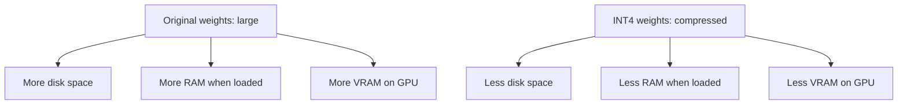
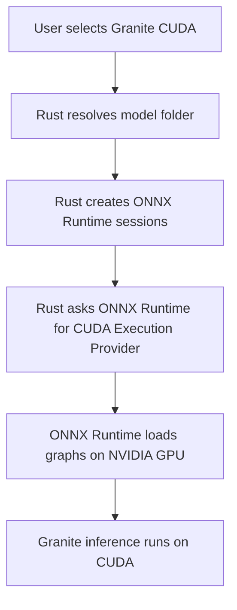

# Granite CUDA Model, Beginner Explanation

This explains what we did to turn the original Granite Speech 4.1 2B NAR model bundle into the faster `granite-speech-4.1-2b-nar-cuda` bundle used by Taurscribe.

The most important thing first:

**We did not train a new model.**
We took the original Granite ONNX files, made them smaller/faster with INT4 weight-only quantization, changed the editor output so the app receives token IDs instead of a huge logits tensor, and then told the Rust app to run that bundle with ONNX Runtime's CUDA backend.

No training. No fine-tuning. No new dataset. The model's learned behavior was not intentionally changed — we only optimized how it is stored and how it is run.

## The Whole Pipeline At A Glance

```text
Original IBM Granite Speech 4.1 2B NAR ONNX bundle
        |
        v
Copy original bundle so the source stays untouched
        |
        v
Apply INT4 weight-only quantization to selected ONNX graphs
        |
        v
Convert heavy MatMul nodes into MatMulNBits nodes
        |
        v
Patch editor.onnx so it outputs token_ids instead of full logits
        |
        v
Package the result as granite-speech-4.1-2b-nar-cuda
        |
        v
Load it in Taurscribe through Rust + ONNX Runtime CUDA Execution Provider
```

The rest of this document walks through each arrow, assuming no prior knowledge of ONNX, CUDA, quantization, logits, or MatMul.

## The Mental Model

Think of the model as a factory.

```text
Audio goes in
    |
    v
Granite factory does math
    |
    v
Text tokens come out
    |
    v
Tokenizer turns tokens into readable text
```

The original Granite factory worked, but it had two expensive habits:

1. Its weights were large, like storing every tool in full-size steel.
2. Near the end, it shipped a giant warehouse of possible answers back to Rust, even though we only needed the best answer.

Our CUDA version fixes those two things.

## Original Granite Bundle

The original model is not one single file. It is a folder with multiple ONNX graphs plus tokenizer/config files.

```text
original-granite-folder/
  encoder.onnx
  projector.onnx
  embed_tokens.onnx
  editor.onnx
  tokenizer.json
  preprocessor_config.json
  other metadata / external weight data
```

Each ONNX file is a separate chunk of the pipeline.

| File | Beginner Meaning | What It Does |
|---|---|---|
| `encoder.onnx` | The ears | Looks at audio features and produces internal audio understanding. |
| `projector.onnx` | The adapter | Converts encoder output into the shape the text model/editor expects. |
| `embed_tokens.onnx` | The token lookup table | Converts token IDs into vectors the editor can understand. |
| `editor.onnx` | The final decision maker | Produces the final text-token predictions. |
| `tokenizer.json` | The dictionary | Converts token IDs into human-readable text. |
| `preprocessor_config.json` | Audio recipe metadata | Tells us how the model expects audio features. |

## Step 1: Copy The Original Bundle

We start by copying the original folder.


Why copy it?

Because we want to preserve the original. If the experiment breaks, we still have a clean source model.

Beginner analogy: this is like duplicating a Photoshop file before making edits. You never paint directly on the only original.

## Step 2: INT4 Weight-Only Quantization

This is the part you asked about:

```text
MatMul -> MatMulNBits
```

To understand that, we need two small concepts.

## What Is A Weight?

A neural network has a huge number of learned numbers called **weights**.

Very simplified:

```text
input numbers × model weights = output numbers
```

The model learned these weights during training. We did **not** relearn them. We only changed how many bits are used to store many of them.

Analogy:

```text
Original weight:
  3.1415926535

Quantized weight:
  approximately 3.14
```

The quantized number is less exact, but much smaller.

## What Is MatMul?

`MatMul` means matrix multiplication.

In transformer models, most of the heavy work is giant matrix multiplication:

```text
[audio/text data] x [big learned weight matrix] = [new hidden representation]
```

Beginner analogy: if the model is a factory, `MatMul` machines are the giant industrial machines doing most of the work. They are everywhere, and they consume most of the memory and compute.

## What INT4 Means

`INT4` means 4-bit integer storage.

The original model stores many weights in larger numeric formats, commonly 16-bit or 32-bit floating point.

Very rough memory comparison:

| Format | Bits Per Number | Beginner Meaning |
|---|---:|---|
| FP32 | 32 bits | Big, precise number |
| FP16 | 16 bits | Smaller, still precise enough for many GPU workloads |
| INT8 | 8 bits | Much smaller |
| INT4 | 4 bits | Tiny, more compressed |

So INT4 can store many model weights using far less memory.

```text
FP16 weight storage:
  [---------------- 16 bits ----------------]

INT4 weight storage:
  [---- 4 bits ----]
```

This does not mean every single value in the model becomes INT4. In our case, it is **weight-only quantization**.

## What Weight-Only Quantization Means

Weight-only quantization means:

```text
Model weights become smaller
Runtime activations usually stay normal precision
```

Weights are the model's stored knowledge. Activations are the temporary numbers created while processing one audio clip.

Analogy:

```text
Weights = books stored on shelves
Activations = notes you write while solving one problem
```

We compressed the books on the shelves. We did not force every temporary note to be tiny too.

That is safer than fully quantizing everything.

## The Actual ONNX Change

Before quantization, many graph nodes look conceptually like this:

```text
input_tensor ----\
                 MatMul ---- output_tensor
weight_matrix --/
```

After INT4 weight-only quantization:

```text
input_tensor --------\
                     MatMulNBits ---- output_tensor
compressed_weights --/
scale/zero data -----/
```

`MatMulNBits` is an ONNX Runtime operator designed for low-bit matrix multiplication.

The important change:

```text
MatMul with big regular weights
```

becomes:

```text
MatMulNBits with compressed 4-bit-ish packed weights
```

## Why This Saves VRAM And RAM

The model has billions of parameters. A lot of RAM/VRAM is just the stored weights.

If we shrink the weights, then loading the model uses less memory.



This is why the quantized version felt dramatically better.

## Which Files Got Quantized?

Our quantization script (`scripts/quantize_granite_int4.py`) targets these ONNX files:

```text
encoder.onnx
projector.onnx
editor.onnx
```

It applies ONNX Runtime's `MatMulNBitsQuantizer` to `MatMul` nodes.

Important detail:

```text
embed_tokens.onnx was not listed in the quantization target set.
```

That is intentional/conservative. Token embedding graphs can involve lookup-style behavior where aggressive quantization may cause compatibility problems or smaller gains.

## Why Not Quantize Everything?

Because "smaller" is not always "works better."

If we quantize too aggressively, we can get:

- Worse word accuracy.
- Unsupported ONNX Runtime operations.
- DirectML/CPU compatibility issues.
- Random crashes.
- Slightly wrong outputs that are hard to debug.

So the safer approach was:

```text
Quantize the heavy MatMul weights first.
Leave more fragile pieces alone.
Benchmark.
Only go further if needed.
```

## Step 3: Prune Stale External Data

Large ONNX models often store weights in sidecar data files, not only inside the `.onnx` file.

Example:

```text
encoder.onnx
encoder.onnx.data
editor.onnx
editor.onnx.data
```

After quantization, some old external data may no longer be referenced.

So we scan the ONNX graphs, find what external files are still used, and remove stale leftovers.

Analogy: after renovating a kitchen, throw away the old cabinets sitting in the garage.

## Step 4: Change `editor.onnx` To Output Token IDs

This is the second big optimization.

The original `editor.onnx` outputs `logits`.

## What Are Logits?

Logits are raw scores before choosing the final token.

Imagine the model has a vocabulary of about 100,352 possible tokens.

For each timestep, the editor says:

```text
token 0 score:      -4.2
token 1 score:       0.1
token 2 score:      -8.7
...
token 100351 score:  2.6
```

Then we pick the highest score.

That operation is called `argmax`.

```text
argmax = index of the largest value
```

## Original Path

Originally, the app effectively did this:


The waste is here:

```text
Huge logits tensor = sequence_len × 100,352 floats
```

That is a lot of data to copy back to CPU just to pick the biggest number.

Analogy: the GPU gives Rust an entire supermarket when Rust only wanted the receipt.

## New Path

We patched `editor.onnx` (with `scripts/make_granite_editor_argmax.py`) so it does the `ArgMax` inside the ONNX graph. The script appends one `ArgMax` node after the logits and replaces the graph's declared output, so the file now exposes a single output named `token_ids`.


Now the GPU/ONNX graph outputs:

```text
token_ids
```

instead of:

```text
logits
```

## Why That Is Faster

Before:

```text
Copy tons of float scores back to CPU
Rust loops through giant score arrays
Rust finds best token per step
```

After:

```text
ONNX graph finds best token
Copy only final token IDs back to CPU
Rust does much less work
```

The result is smaller transfers and less CPU post-processing.

## How Rust Knows Which Editor It Has

Rust does not assume the editor was patched. After running the editor session, it inspects the outputs:

```text
Output named "token_ids" exists?
  yes -> use it directly (fast path: CTC collapse + tokenizer decode)
  no  -> read "logits" and do argmax on the CPU (original slower path)
```

So an unpatched Granite bundle still works in Taurscribe. The patched CUDA bundle is simply faster because Rust can skip the CPU argmax and the giant logits copy.

## What CTC Collapse Means

Granite can output repeated tokens and blank tokens.

Example:

```text
Raw token IDs:
  H H blank E E L L L blank O

After CTC collapse:
  H E L O
```

This is normal in speech models.

So after `token_ids` comes back, Rust still does:

```text
remove repeats
remove blank tokens
decode with tokenizer
```

## Step 5: Rename/Place The Bundle As The CUDA Artifact

After quantization and editor patching, the app treats the folder as:

```text
granite-speech-4.1-2b-nar-cuda
```

This name does not mean the ONNX file contains CUDA code.

It means:

```text
This artifact is the one we intend to run through ONNX Runtime CUDA.
```

## Step 6: Rust Chooses CUDA

CUDA is chosen mostly in the Rust app, not inside the ONNX file.



For the CUDA artifact, the app tries to load all four ONNX sessions on CUDA:

```text
encoder      -> CUDA
projector    -> CUDA
embed_tokens -> CUDA
editor       -> CUDA
```

## What ONNX Runtime Does

ONNX Runtime is the engine that runs ONNX graphs.

The ONNX file says:

```text
Here are the math operations.
```

ONNX Runtime says:

```text
I know how to run those operations on CPU, CUDA, DirectML, etc.
```

Rust says:

```text
Use CUDA for this model.
```

Then ONNX Runtime tries to run the ONNX graph using NVIDIA's CUDA libraries.

## What CUDA Does

CUDA is NVIDIA's GPU compute system.

In this app:

```text
CUDA is the hardware acceleration route.
```

It lets matrix multiplication and transformer operations run on the NVIDIA GPU instead of only the CPU.

## What We Did For CUDA Stability

On Windows, CUDA loading can fail if DLLs are missing or loaded from the wrong place.

So the app preloads important DLLs such as:

```text
cudart64_12.dll
cublas64_12.dll
cublasLt64_12.dll
cufft64_11.dll
cudnn64_9.dll
other cuDNN 9 split DLLs
```

This helps ONNX Runtime find the CUDA/cuDNN runtime it needs.

Beginner analogy: before starting the factory, we make sure the power cables, hydraulic lines, and control modules are already plugged in.

## Low-RAM Mode Versus Perf Mode

The app has two kinds of ONNX Runtime settings for Granite.

### Low-RAM Mode

Low-RAM mode tries to save memory.

It uses conservative settings like:

```text
less prepacking
less memory pattern optimization
less parallel execution
smaller CUDA workspace
```

This is safer but can be slower.

### Perf Mode

Perf mode allows more speed-focused behavior:

```text
prepacking enabled
memory patterns enabled
parallel execution enabled
CUDA workspace allowed
TF32 enabled where useful
warmup enabled
```

This can use more memory, but it is faster for benchmarking and strong NVIDIA GPUs.

Perf mode is opt-in through an environment variable:

```text
TAURSCRIBE_GRANITE_ORT_MODE = perf   (also accepts "performance" or "speed")
```

If the variable is unset, Granite loads in low-RAM mode.

## Warmup

Warmup means running a small fake/silent inference once after loading.

Why?

The first run often pays startup costs:

```text
compile/prepare kernels
allocate GPU memory
build internal execution plans
cache optimized paths
```

After warmup, the first real user recording is less likely to be slow.

Analogy: start the car and let the engine settle before driving.

## Before Versus After

| Area | Original Granite | Taurscribe CUDA Granite |
|---|---|---|
| Training | IBM-trained model | Same IBM-trained model |
| Architecture | Granite Speech 4.1 2B NAR | Same architecture |
| Main graph format | ONNX | ONNX |
| Heavy weights | Larger MatMul weights | INT4 `MatMulNBits` weights |
| Editor output | Full logits | Token IDs |
| GPU transfer | Huge logits copied back | Small token ID array copied back |
| Runtime target | Depends on caller | Rust chooses CUDA |
| Best platform | General/reference | NVIDIA GPU |

## Two Kinds Of Changes, Kept Separate

It helps to separate what lives **inside the model files** from what lives **inside the app**.

Model file changes (baked into the ONNX bundle on disk):

```text
- INT4 MatMulNBits quantization (encoder.onnx, projector.onnx, editor.onnx)
- editor.onnx token_ids output patch (ArgMax moved inside the graph)
```

Runtime/app changes (Taurscribe's Rust code, applied at load/run time):

```text
- Rust chooses CUDA through ONNX Runtime's CUDA Execution Provider
- CUDA/cuDNN DLL preload on Windows
- performance mode (prepacking, memory patterns, parallel execution, TF32)
- warmup run after load
```

Remember: the ONNX files contain no CUDA code. "CUDA model" really means "an ONNX bundle optimized and intended for CUDA, plus app code that loads all four graphs (encoder, projector, embed tokens, editor) on CUDA."

## What Changed And What Did Not

Changed:

- Copied original ONNX bundle.
- Quantized `MatMul` weights in selected ONNX files to INT4 using `MatMulNBits`.
- Removed stale external data files after quantization.
- Patched `editor.onnx` so it outputs `token_ids`.
- Changed Rust inference path to accept `token_ids`.
- Added/used CUDA runtime loading path in Rust.
- Added CUDA DLL preload behavior on Windows.
- Added perf/warmup runtime options.

Not changed:

- No retraining.
- No new dataset.
- No fine-tuning.
- No custom CUDA kernel.
- No tokenizer rewrite.
- No change to the core Granite model identity.
- No semantic redesign of the ASR pipeline.

## What The Final Artifact Is

The shortest accurate description of `granite-speech-4.1-2b-nar-cuda`:

```text
Granite Speech 4.1 2B NAR
INT4 weight-only ONNX
token_ids argmax editor
CUDA runtime target
```

## The Simplest Accurate Summary

```text
We took IBM's Granite Speech ONNX model,
compressed the heavy matrix weights to INT4,
moved final argmax into the ONNX editor graph,
made Rust consume token_ids instead of giant logits,
and configured ONNX Runtime to run the resulting bundle on CUDA.
```

## Where The Tools Live

| File | Role |
|---|---|
| `scripts/quantize_granite_int4.py` | Copies the bundle, INT4-quantizes MatMul weights in encoder/projector/editor, prunes stale external data |
| `scripts/make_granite_editor_argmax.py` | Copies the bundle, patches `editor.onnx` to output `token_ids` |
| `scripts/make_granite_portable_dml.py` | Builds the portable (non-NVIDIA) bundle: DirectML-compatible encoder rewrite on top of the INT4 argmax graphs |
| `src-tauri/src/granite.rs` | Rust loader/inference: CUDA sessions, DLL preload, token_ids detection, CTC collapse, warmup |
| `src-tauri/src/ort_session.rs` | ONNX Runtime session settings for low-RAM and perf modes |

## The Portable (Non-NVIDIA) Sibling

`granite-speech-4.1-2b-nar-portable` is a second artifact for machines without
NVIDIA CUDA (AMD/Intel GPUs, CPU-only). It shares the CUDA bundle's INT4
`MatMulNBits` weights and `token_ids` editor, plus three encoder-graph rewrites
that exist only because of DirectML:

1. **Rank-5 attention MatMuls become rank-3.** The Granite conformer computes
   windowed attention as `[1, 4 windows, 8 heads, 200, 128]` matrix products.
   DirectML rejects rank-5 MatMul with `E_INVALIDARG` on every GPU vendor, so
   the portable encoder wraps each one in Reshapes that merge the static
   `(1, 4, 8)` batch dims into `32`.
2. **Shape chains are baked to constants.** Half the conformer layers compute
   their Reshape/Slice operands at runtime from `Shape` ops. DirectML crashes
   with a native access violation while compiling partitions around those.
   Because the app always pads encoder input to a fixed 800-frame bucket, the
   values are constant in practice, so the build script evaluates them once
   and prunes ~950 shape-arithmetic nodes.
3. **GLU Split nodes become Slice pairs.** DirectML can silently mis-execute
   the encoder's two-output Split operations inside fused partitions. Two
   explicit Slice operations produce the same channel halves without the
   incorrect fused result.

Neither change alters the math: encoder outputs match the CUDA bundle to
~4e-5 relative — ordinary float reassociation noise.

On Windows, the portable bundle now attempts **full DirectML first** and falls
back to multi-threaded CPU. A 30-utterance end-to-end run on the Radeon 780M
measured 4.045 seconds per utterance through DirectML versus 8.823 seconds on
the Ryzen 7 8845HS CPU at eight threads. Its manifest carries
`"encoder_dml_safe": true`, which authorizes all four graphs to load on
DirectML. The CUDA artifact is unchanged by all of this.

## Tiny Analogy Version

Original Granite:

```text
A huge factory sends an entire warehouse of possible answers to the office.
The office then sorts everything and picks the final answer.
```

Taurscribe CUDA Granite:

```text
We compress the factory machinery,
make the factory pick the final item before shipping,
and send only the small final receipt to the office.
Then we run the factory on NVIDIA power.
```
