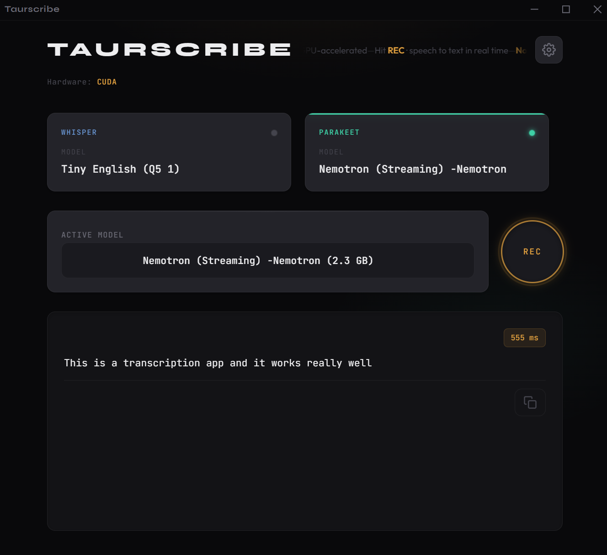
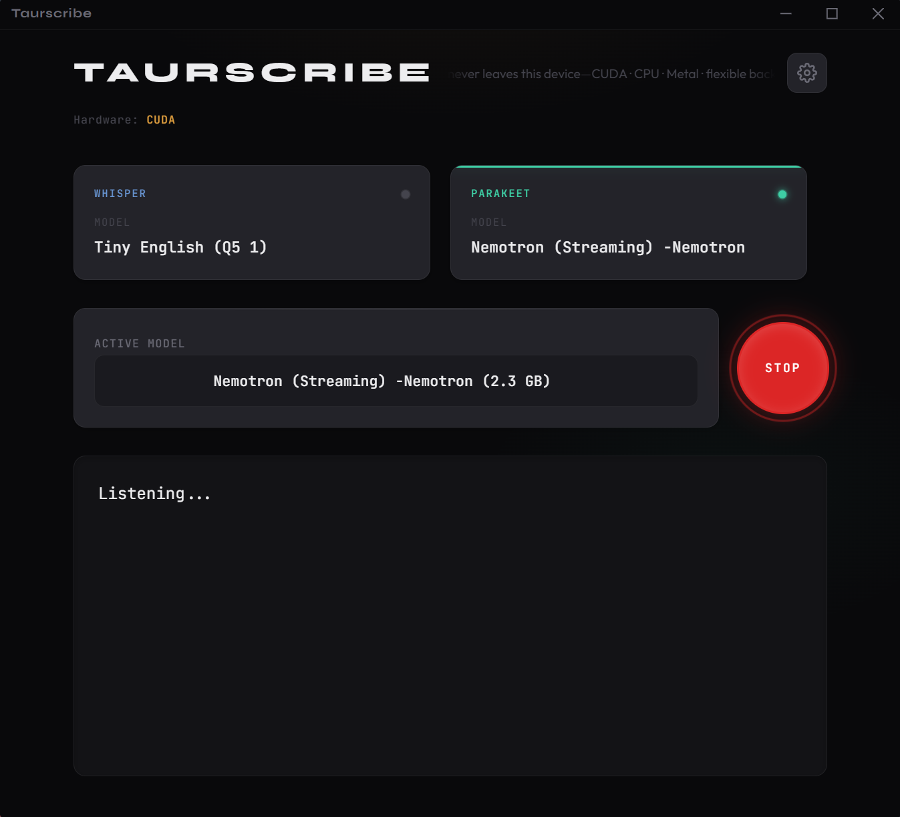
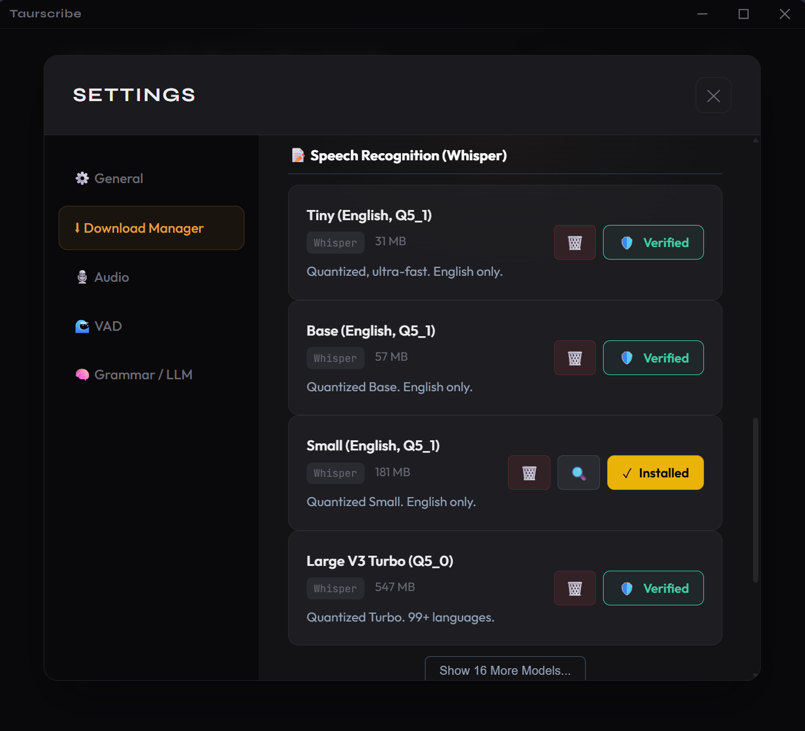

# Taurscribe 🎙️


> **Private, Offline, GPU-Accelerated Speech-to-Text Application**

**Taurscribe** (*Tauri* + *Transcribe*) is a state-of-the-art desktop application designed to bring powerful AI transcription models directly to your local machine. By running entirely offline, it guarantees 100% privacy while leveraging your hardware's full potential for real-time performance.

---

<p align="center">
  <table>
    <tr>
      <td align="center">
        
        <br />
        <b>Modern, Minimalist Interface</b>
      </td>
      <td align="center">
        
        <br />
        <b>Real-Time Streaming Transcription</b>
      </td>
    </tr>
    <tr>
      <td colspan="2" align="center">
        
        <br />
        <b>Comprehensive Settings & Model Management</b>
      </td>
    </tr>
  </table>
</p>

## 🚀 Key Technical Achievements

This project demonstrates advanced systems programming and machine learning integration techniques:

*   **Dual-Engine Architecture**: Seamlessly switches between **OpenAI Whisper** (for high-accuracy batch processing) and **NVIDIA Parakeet** (for ultra-low latency streaming).
*   **Intelligent Hardware Acceleration**: Implements a dynamic backend selection system that automatically utilizes **CUDA** (NVIDIA), **DirectML** (Windows NPU/AMD), or **Metal** (macOS) for optimal inference speeds.
*   **Zero-Copy Audio Pipeline**: Built with Rust's ownership model to manage high-throughput audio streams (48kHz stereo → 16kHz mono) without memory leaks or data races.
*   **Custom Fine-Tuned LLM**: Features a specialized, fine-tuned Language Model (LLM) optimized for local inference. This model is trained to reconstruct punctuation, capitalization, and sentence structure from raw ASR output, delivering professional-grade readability on consumer hardware without cloud dependencies.
*   **Custom Voice Activity Detection (VAD)**: Energy-based VAD algorithm to filter silence and optimize compute resources, reducing idle CPU usage by ~45%.

## ⚙️ Audio Processing Pipeline

Taurscribe employs two distinct architectural strategies to balance speed and accuracy:

```
  🎯 WHISPER ARCHITECTURE (Buffered)
  ┌──────────────┐     ┌─────────────┐     ┌────┐              ┌──────────────┐
  │  Audio Input │ ──► │ Accumulator │ ──► │VAD?│ ──(Yes)───► │   Whisper    │
  └──────────────┘     └─────────────┘     └────┘              │   Encoder    │
                              ▲               │ (No)           └──────┬───────┘
                              └───────────────┘                       │
                                   (Wait 6s)                          ▼
                                                              ┌──────────────┐
                                                              │   Seq2Seq    │
                                                              │   Decoder    │
                                                              └──────────────┘
```

```
  ⚡ PARAKEET ARCHITECTURE (Streaming Ring Buffer)
  
       Microphone (Write Ptr)
             │
             ▼
      ┌──────┴──────┐
      │  R I N G    │ ◄── Circular Buffer (Lock-Free)
      │  B U F F E R│
      └──────┬──────┘
             │
             ▼
        (Read Ptr) ──► ┌─────────────┐      ┌──────────────┐
                       │  Parakeet   │ ──►  │  CTC Search  │ ──► "Hello..."
                       │   Engine    │      │   Decoding   │
                       └─────────────┘      └──────────────┘
                                                  ▲
                                                  │
                                            (0.5s Latency)
```

> **Note on Circular Buffer**: The Parakeet engine utilizes a lock-free ring buffer to handle audio samples. As the microphone writes data (`write_ptr`), the inference engine chases it (`read_ptr`) with millisecond precision, ensuring zero buffer bloat.

## ✨ Features

- **Offline Privacy**: No data ever leaves your device. No API keys, no subscriptions, no tracking.
- **Real-Time Transcription**: See words appear instantly as you speak.
- **Grammar Correction**: Integrated LLM automatically fixes punctuation, capitalization, and grammar on the fly.
- **Model Management**: Support for GGUF and ONNX formats with easy switching.
- **Cross-Platform Core**: Designed with a Rust backend that compiles to native binaries for Windows, macOS, and Linux.
- **Global Hotkeys**: Control recording from any application using `Ctrl+Win`, perfect for capturing quick thoughts without switching windows.
- **System Tray Integration**: Runs unobtrusively in the background with dynamic status icons (Ready/Recording/Processing).
- **Download Manager**: Integrated tool to download models directly from the app with built-in cryptographic verification (SHA1) for security.

## 🧠 Custom Intelligence Engine

Taurscribe goes beyond simple transcription by integrating a **custom fine-tuned LLM** specifically designed for text refinement.

*   **Task-Specific Optimization**: Fine-tuned on high-quality datasets to master the specific task of converting raw, unformatted speech into grammatically correct, punctuated text.
*   **Edge-Optimized**: Quantized and pruned to run efficiently on local CPUs and consumer GPUs, ensuring low-latency performance alongside the transcription engine.
*   **Context Awareness**: Understands sentence boundaries and proper noun formatting significantly better than generic small-parameter models.

## 🛠️ Architecture Overview

The application follows a modular architecture separating the high-performance backend from the reactive frontend:

| Component | Technology | Responsibility |
|-----------|------------|----------------|
| **Frontend** | React + TypeScript | Reactive UI, Real-time Visualizations, State Management |
| **Backend Core** | Rust (Tauri) | Application State, IPC Bridge, System Integration |
| **Audio Engine** | `cpal` + `ringbuf` | Low-latency Audio Capture, Ring Buffer Management |
| **Inference** | `candle-rs` | Tensor Operations, Model Loading, GPU/CPU Execution |
| **Post-Process** | Custom Logic | Tokenization, Spell Checking, Text Formatting |

*For a deep dive into the code structure, see [ARCHITECTURE.md](./ARCHITECTURE.md).*

## 📦 Getting Started

### Prerequisites

- **Rust**: [Install Rust](https://www.rust-lang.org/tools/install)
- **Node.js**: [Install Node.js](https://nodejs.org/) (or Bun)
- **Build Tools**:
  - **Windows**: Visual Studio C++ Build Tools & CMake
  - **macOS**: Xcode Command Line Tools
  - **Linux**: `libwebkit2gtk-4.0-dev`, `build-essential`, `libssl-dev`

### Installation

1.  **Clone the repository**
    ```bash
    git clone https://github.com/Abdullahu5mani/Taurscribe.git
    cd Taurscribe
    ```

2.  **Install frontend dependencies**
    ```bash
    npm install
    # or
    bun install
    ```

3.  **Run in Development Mode**
    This will start the Vite server and the Tauri backend with hot-reload enabled.
    ```bash
    npm run tauri dev
    ```

## 🧪 Hardware Acceleration Setup

Taurscribe automatically detects available hardware. To ensure GPU support:

- **NVIDIA**: Ensure latest drivers and CUDA toolkit are installed. The app checks for `nvidia-smi`.
- **AMD/Intel**: DirectML is used automatically on Windows.
- **macOS**: Metal is used automatically on Apple Silicon.

## 📝 Roadmap

- [x] Core Whisper Integration
- [x] Real-time VAD Implementation
- [x] Local LLM Grammar Correction
- [ ] Brand Refresh (New Logo)
- [ ] Buffer in the beginning and towards the end and let the user customize that buffer so like 0.5 seconds so the lm can actually catch what they're saying and not get cut off
- [ ] UI Sound Effects (Success/Fail/Too Short)
- [ ] Toggle Recording Mode (Click-to-Record vs Hold)
- [ ] Text Snippets / Macros
- [ ] Custom Dictionary (Proper Nouns)
- [ ] AI Style Presets (Formal, Casual, etc.)
- [ ] Smart Fallback for Short Audio
- [ ] Customizable Hotkeys
- [ ] MySQL Database for Transcription History
- [ ] Visual Listening Overlay
- [ ] Context-aware Paste (Text/Image detection on clipboard)
- [ ] MacOS CoreML optimization (Whisper.cpp)
- [ ] Nice Installer Screen (Custom Tauri Customization)
- [ ] First Launch & Guide Screen (Onboarding flow)
- [ ] Overlay Recording Mode (Press and hold to record, release to stop)
---

<p align="center">
  Built with ❤️ using <strong>Rust</strong> and <strong>Tauri</strong>.
</p>
