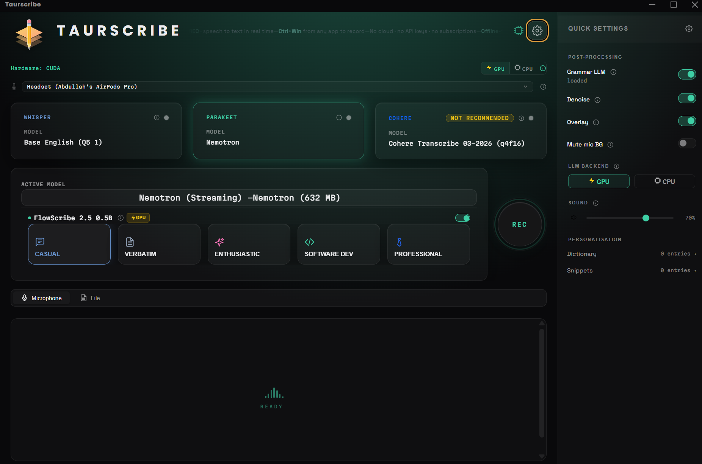
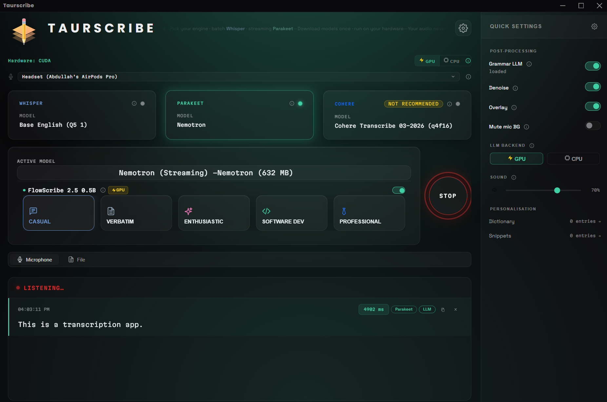

<!--
Logo and tagline section
-->
<div align="center">
  
  <h1>Taurscribe</h1>
  <strong>Local speech-to-text that respects your privacy</strong>
  
<br/>

**Private • Offline • GPU-Accelerated • Instant**


</div>

---

## What is Taurscribe?

Taurscribe is a desktop application for local, offline speech-to-text transcription. Unlike cloud-based solutions, everything runs on your machine—your audio never leaves your computer.

Built on Tauri (Rust + React), Taurscribe gives you the speed and accuracy of cloud services with the privacy and control of local software. Choose your transcription engine, enable post-processing, and get publication-ready text instantly.

### Key attributes

* **Local-first**: No cloud APIs, no tracking, no surprises
* **Choice of engines**: Whisper (accuracy), Parakeet (speed), or Cohere (alternative)
* **Smart post-processing**: AI-powered grammar correction and spell-checking
* **Cross-platform**: Windows, macOS, Linux
* **GPU-accelerated**: Automatic hardware detection (NVIDIA CUDA, Apple Metal, AMD Vulkan)

---

## Why Taurscribe?

**Privacy First.** Your voice never touches a server. No API keys. No tracking. No surprises.

**Blazingly Fast.** Three speech engines optimized for different workflows:
- **Whisper** — Highest accuracy for important content
- **Parakeet** — Ultra-low latency streaming transcription
- **Cohere** — Alternative engine for specialized use cases

**Production Quality.** AI-powered grammar correction with **FlowScribe LLM v2**—a fine-tuned language model that automatically fixes punctuation, capitalization, tone, and readability without the latency of cloud APIs.

---

## Features

### Transcription

| Feature | Details |
|---------|---------|
| **Multiple engines** | Switch engines on-the-fly; Whisper and Parakeet are mutually exclusive to save VRAM |
| **Real-time streaming** | Parakeet delivers sub-500ms latency; see words appear as you speak |
| **Batch processing** | Drag audio/video files into the app for high-accuracy offline transcription |
| **Global hotkey** | Press Ctrl+Win anywhere to record (even behind other windows) |
| **File support** | All common audio and video codecs via ffmpeg |

### Text quality

| Feature | Details |
|---------|---------|
| **Grammar & tone correction** | FlowScribe LLM v2 fine-tuned for 0.5B parameters, runs in <100ms on CPU |
| **Tone styles** | Casual, Verbatim, Enthusiastic, Software Dev, Professional |
| **Spell checking** | SymSpell dictionary with custom word-list support |
| **Personalization** | User dictionary for consistent technical term transcription |

### Control & integration

| Feature | Details |
|---------|---------|
| **First-run wizard** | Hardware detection and engine onboarding |
| **Quick settings** | One-click toggles for quality, tone, and spell-check |
| **System tray** | Minimal background presence with LED status signaling |
| **Model management** | Download, verify, and switch models without restarting |
| **Auto-save** | Configure custom save locations and auto-format output |

---

<p align="center">
  
  <br/>
  <i>Clean, focused interface. Status and settings at a glance.</i>
</p>

<p align="center">
  
  <br/>
  <i>Real-time streaming with instant visual feedback and live output.</i>
</p>

---

## Architecture: Two transcription strategies

### Whisper: Buffered accuracy-first approach

Accumulates ~6 seconds of audio with voice activity detection (VAD), then sends to the Whisper encoder when speech is detected.

```
Input: Microphone (16kHz mono)
  ▼
Ring Buffer (6s accumulation)
  ▼
Voice Activity Detector
  ├─ Silence detected → wait
  ├─ Speech detected → send to encoder
  ▼
Whisper Encoder → Output
```

### Parakeet: Lock-free streaming approach

Uses a non-blocking ring buffer for sub-500ms latency. The inference process "chases" the write pointer, producing output continuously.

```
Microphone (48kHz stereo)
  ▼
Resampler (16kHz mono)
  ▼
Lock-Free Ring Buffer (write → read)
  ▼
Parakeet Engine (continuous inference)
  ▼
CTC Decoding → Output stream
```

**Why two?**
- **Whisper** optimizes for accuracy; best for meetings, interviews, archival
- **Parakeet** optimizes for responsiveness; best for real-time note-taking, live captions

---

## Transcription engines

| Engine | Latency | Primary use | Format |
|--------|---------|-------------|--------|
| **Whisper** | 2–10s | High-accuracy transcription | GGUF |
| **Parakeet** | <500ms | Real-time streaming | ONNX |
| **Cohere** | Varies | Alternative backbone | ONNX |

Engines are **mutually exclusive**—switching unloads the previous one to free VRAM.

---

## FlowScribe LLM v2: Local text refinement

Raw ASR output is often rough. FlowScribe v2 is a fine-tuned, locally-hosted language model that runs in under 100ms:

Model: [flowscribe-qwen2.5-0.5b-v2](https://huggingface.co/Abdullahu5mani/flowscribe-qwen2.5-0.5b-v2)

```
Raw:       "im going to the coffee shop tomorrow at two"
Refined:   "I'm going to the coffee shop tomorrow at 2 PM."
```

Handles:
* Punctuation and capitalization
* Contractions and grammar
* Tone adaptation (Professional, Casual, Enthusiastic, etc.)
* Technical term consistency via user dictionary

**No cloud round-trip. No latency penalty.**

---

## Workflows

### Quick hotkey capture

1. Press **Ctrl+Win** anywhere (foreground or background)
2. Speak naturally
3. Press **Ctrl+Win** to stop
4. Optional: Spell-check and grammar refinement
5. Text auto-types into active window

### Batch file transcription

1. Drag audio/video files into app (or browse)
2. Select engine and tone
3. Monitor real-time progress
4. Review, edit, or retry individual items

### Model setup

* Download via in-app interface with progress tracking
* Automatic extraction (ZIP, CoreML)
* SHA verification for integrity
* `.verified` markers prevent re-checks

---

## Privacy & security

* **Zero cloud**—All inference local
* **Model-gated**—Recording blocked until model installed
* **Duration guards**—Rejects recordings <600ms (silence filtering)
* **Engine consistency**—File queues stay on same engine
* **Permissions**—Platform-native mic access flows (Windows, macOS, Linux)

---

## Hardware acceleration

Auto-detect and use:

| OS | Whisper | Parakeet/ORT | Grammar LLM |
|----|---------|--------------|-------------|
| Windows x64 | CUDA, Vulkan | CUDA, DirectML, TensorRT | CUDA |
| macOS | Accelerate | XNNPACK | Metal |
| Linux x64 | CUDA, Vulkan | CUDA, TensorRT | CUDA |
| Windows ARM64 | CPU | DirectML, XNNPACK | CPU |

NVIDIA GPUs try CUDA first, falling back to DirectML to avoid reshape failures.

---

## Model verification

SHA-1 integrity check pipeline:

1. **Registry** — Hashes in binary (OpenAI/official upstream)
2. **Download** — Stream from Hugging Face with progress
3. **Verify** — 8KB chunk-by-chunk validation
4. **Mark** — `.verified` file prevents re-verification
5. **Safe** — Load fails explicitly if hash mismatches

All Whisper GGML models verified (tiny through large-v3-turbo, all quantizations).

---

## Technical stack

| Layer | Tools | Responsibility |
|-------|-------|-----------------|
| **Frontend** | React, TypeScript | UI, model switching, transcription display |
| **IPC** | Tauri, Serde | Frontend ↔ Backend messaging |
| **Audio** | CPAL, RingBuf (Rust) | Microphone capture, multi-threaded pipeline |
| **Inference** | whisper.rs, parakeet.rs, ORT | Model loading, GPU dispatch, streaming |
| **Post-process** | llama-cpp-2, SymSpell | Grammar LLM, spell-check |
| **Platform** | Native APIs | Hotkeys, tray, file dialogs, permissions |

See [ARCHITECTURE.md](./ARCHITECTURE.md) for deeper dive.

---

## Highlights

* **Zero-copy audio pipeline** — Rust ownership prevents leaks
* **Lock-free ring buffer** — Sub-millisecond Parakeet latency from wait-free structures
* **Custom VAD** — Energy-based voice activity detection, ~45% idle CPU reduction
* **Dynamic backend selection** — CUDA → Vulkan → CPU routing
* **Quantized LLM** — FlowScribe v2 at 0.5B parameters, <100ms inference

---

## Getting started

### System requirements

* GPU optional but recommended (NVIDIA/AMD/Metal for <1s latency)
* 4GB+ RAM per active engine
* 2GB+ disk per model

### Installation

1. Download from [Releases](https://github.com/Abdullahu5mani/Taurscribe/releases)
2. Run installer (Windows, macOS, or Linux)
3. Launch → Setup Wizard guides hardware and engine selection
4. Download a model (smallest: ggml-tiny.bin ~75MB)
5. Test: Press **Ctrl+Win**

---

## Development

```bash
# Install dependencies
npm install

# Start dev server with live reload
npm run tauri dev

# Build for production
npm run tauri build

# Quick Rust check (faster than full build)
cd src-tauri && cargo check

# Run test suite
cd src-tauri && cargo test
```

See [CLAUDE.md](./CLAUDE.md) and [AGENTS.md](./AGENTS.md) for development guidance.

---

## License

MIT License — See [LICENSE](LICENSE)

---

## Acknowledgments

Built with:
* **whisper.rs** (ggerganov/whisper.cpp)
* **ONNX Runtime** (Microsoft)
* **llama.cpp** (ggerganov)
* **Tauri** (Desktop framework)
* **React 19** (UI framework)

---

## Support & contributions

* Issues: [GitHub Issues](https://github.com/Abdullahu5mani/Taurscribe/issues)
* Discussions: [GitHub Discussions](https://github.com/Abdullahu5mani/Taurscribe/discussions)
* Contributing: See [CONTRIBUTING.md](./CONTRIBUTING.md)

---

**Taurscribe: Speech-to-text on your terms.**
