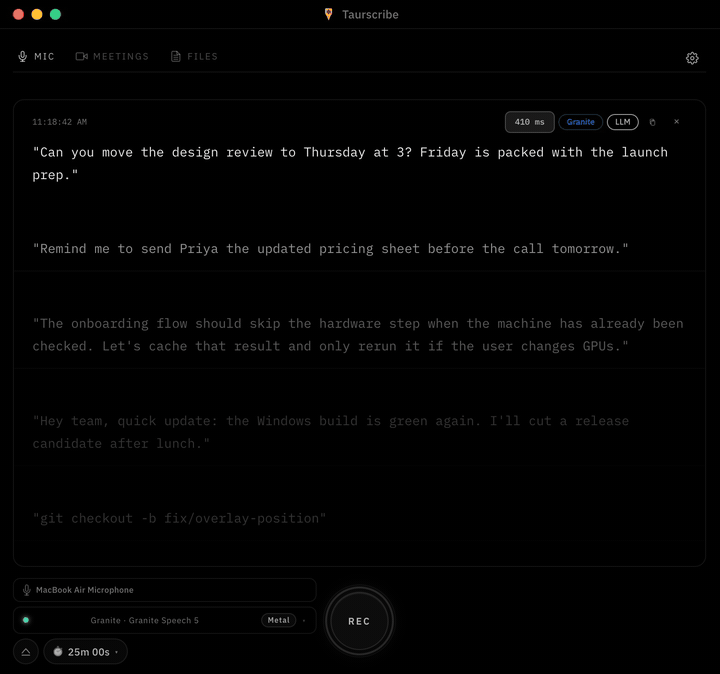
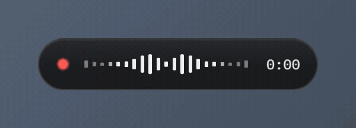
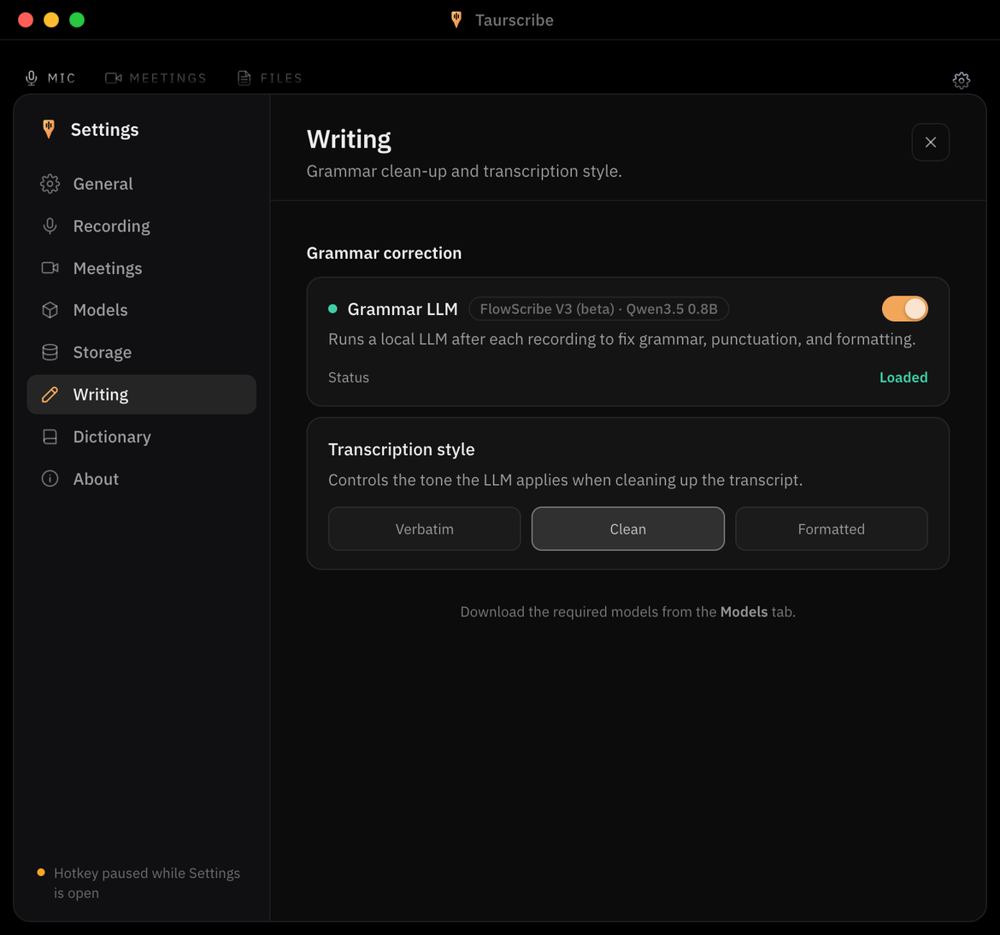
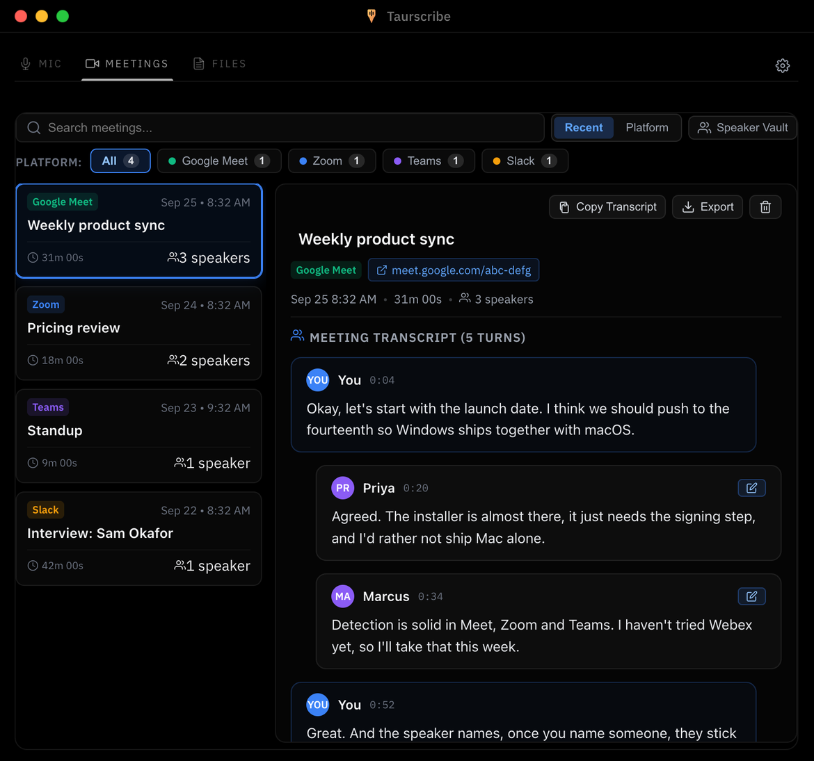
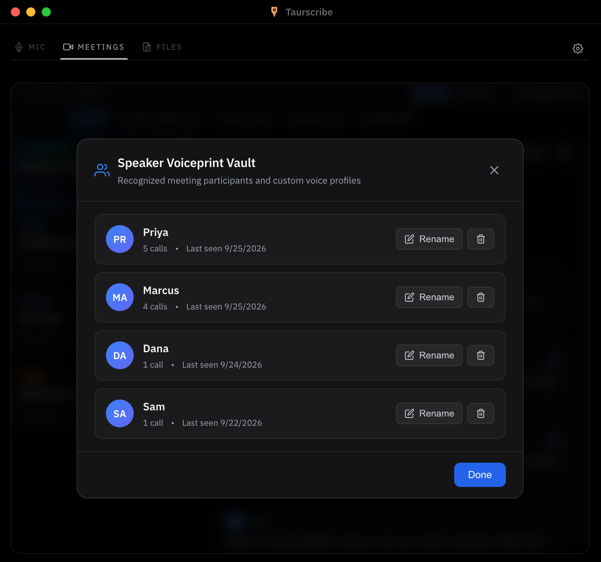
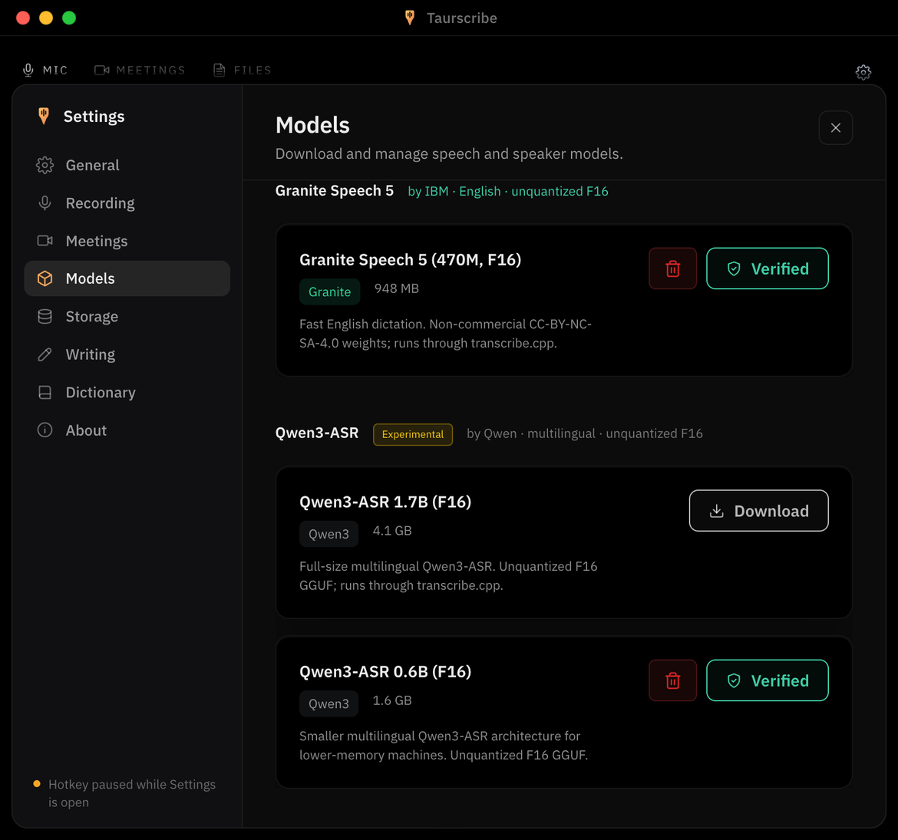
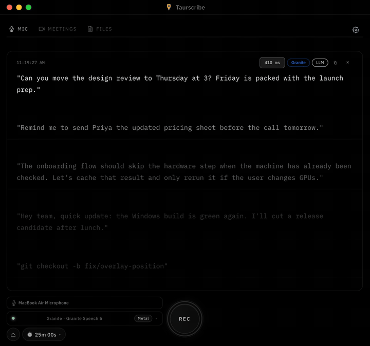
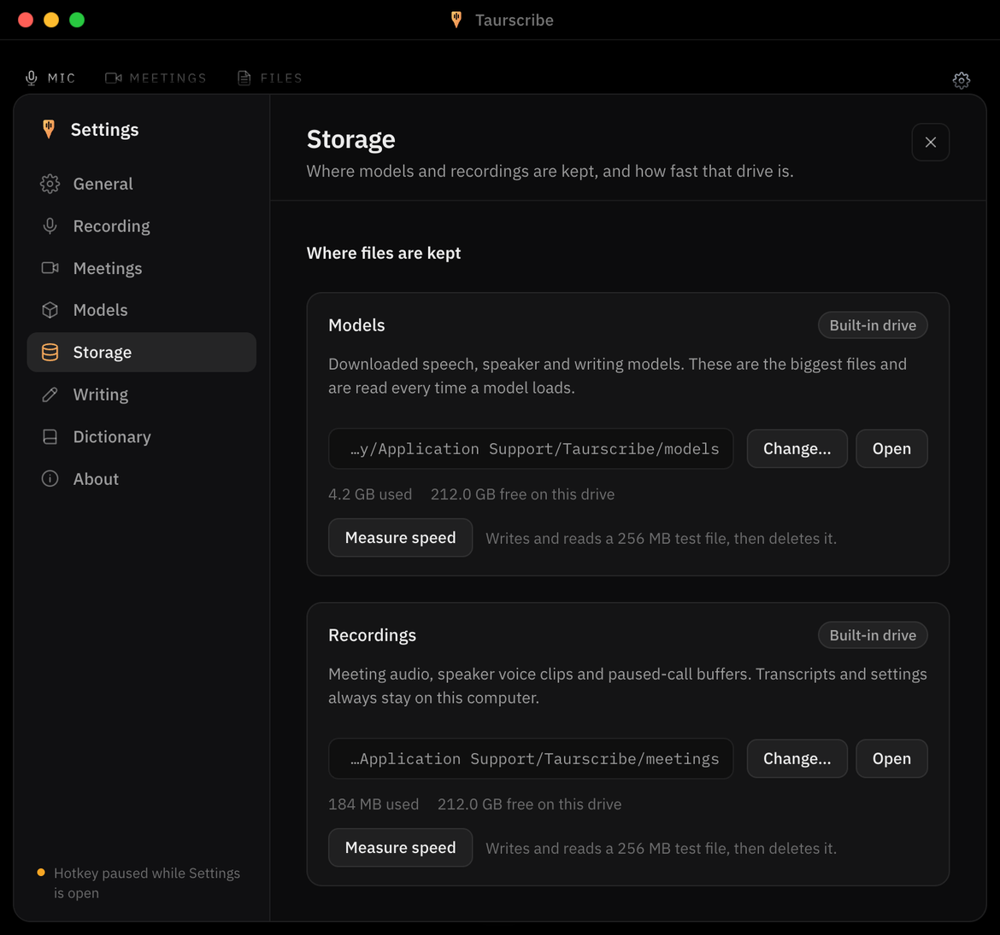
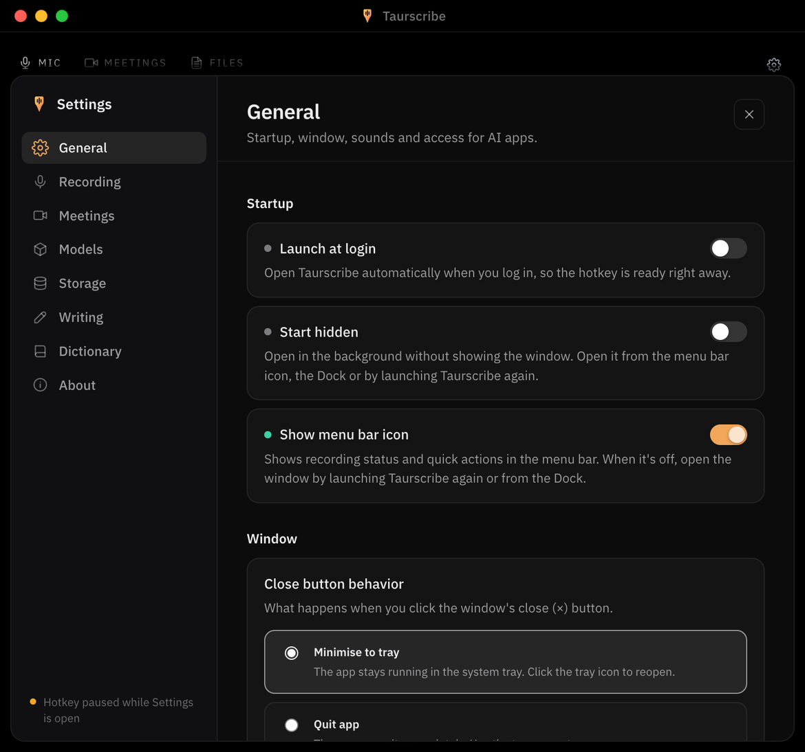
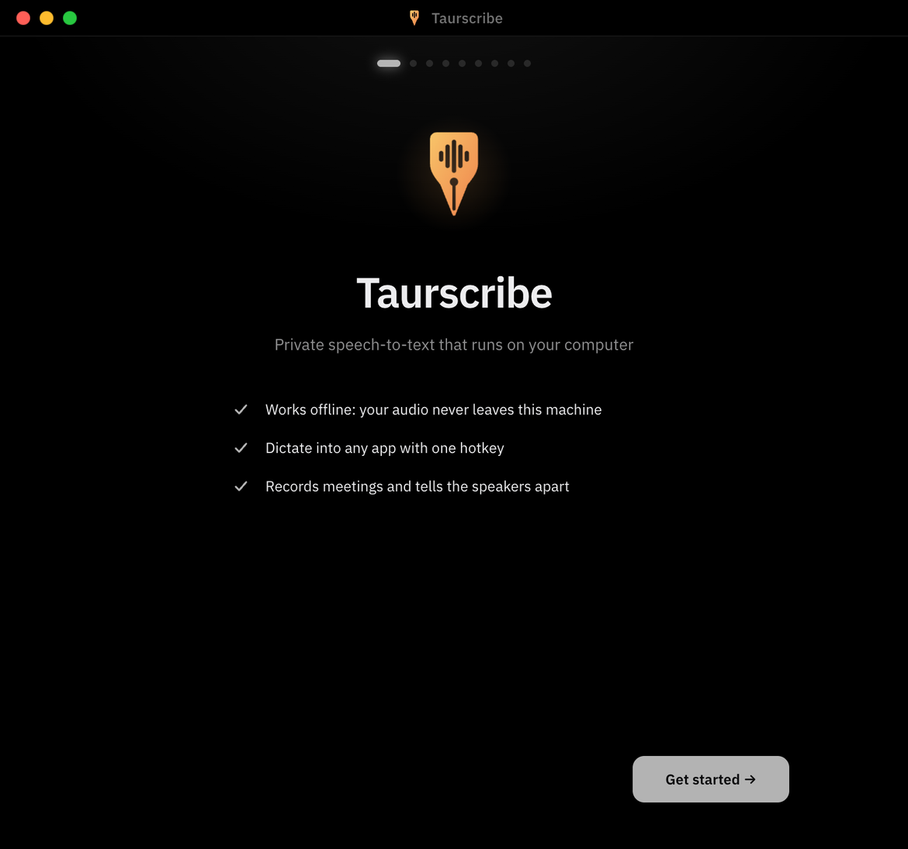

<div align="center">
  
  <h1>Taurscribe</h1>
  <p>Dictation and meeting notes that run entirely on your own computer.</p>
</div>

<p align="center">
  
</p>

Hold a hotkey, talk, let go. Taurscribe transcribes what you said, cleans it up, and pastes it into whatever app you're typing in. It can also record your calls in Zoom, Meet, Teams and the rest, and gives you a transcript split by speaker.

Nothing is sent anywhere. The speech models run on your machine, so it works offline, on a plane, or on a laptop with no account at all. The only time it touches the network is when you download a model.

It runs on macOS, Windows and Linux, and uses your GPU when it can (Metal on Macs, CUDA or Vulkan elsewhere).

## Dictation

Press **Ctrl + Option** on a Mac (**Ctrl + Win** on Windows and Linux) in any app and start talking. A small pill shows up at the bottom of the screen while you speak, then the text lands where your cursor is.

<p align="center">
  
</p>

Every dictation also goes into the feed in the main window, so you can copy it again later. You pick the speech engine and model in the bottom bar, and the model unloads itself after a while if you don't use it, so it isn't holding onto memory all day.

## FlowScribe: cleanup that knows what you meant

Speech recognizers write down exactly what you said, "um"s and restarts included. FlowScribe is a small language model I trained to turn that into what you meant to write:

```
you said:   um lets meet at three no wait four in the tory channel
you get:    Let's meet at 4 in the Tauri channel.
```

It drops fillers and false starts, takes your corrections ("three, no wait, four"), writes numbers, dates, emails and file paths properly, and turns "comma" or "new paragraph" into punctuation. It knows which app you're typing into, so an email comes out formatted like an email and a terminal command stays a command. Words from your dictionary get spelled your way even when the recognizer mishears them.

It never rewrites your tone or adds anything. If its output ever contains a number that wasn't in what you said, or it starts repeating itself, Taurscribe throws it away and pastes the plain transcript instead.

You can choose how much it changes: **Verbatim** (punctuation and casing only), **Clean** (the default), or **Formatted**.

FlowScribe V3 is a fine-tune of Qwen3.5 0.8B and is still in beta. The weights and training details are on [Hugging Face](https://huggingface.co/Abdullahu5mani/flowscribe-qwen3.5-0.8b-v3), and the data generation and training scripts are in [`scripts/flowscribe_data`](scripts/flowscribe_data) and [`scripts/flowscribe_train`](scripts/flowscribe_train).

<p align="center">
  
</p>

## Meetings

When a call starts, Taurscribe notices, whether it's in the Zoom, Teams or Slack desktop app or in a browser tab. You get a banner offering to record, or you can have it record on its own. No bot joins your call.

It records your microphone and the call audio as two separate channels, so it always knows which lines are yours. The other side gets split by speaker. Name someone once and they're recognized by voice in later calls.

<p align="center">
  
</p>

<p align="center">
  
</p>

Transcripts can be searched, copied, or exported as Markdown. If you use Claude, ChatGPT or Cursor, you can let them search your transcripts through MCP. It's read-only and off until you turn it on.

## Models

You download only the models you want, from the Models tab. Every download is checked against a pinned SHA-256 before it's used.

| Model | Size | Languages | Notes |
|---|---|---|---|
| **Granite Speech 5** (IBM) | 948 MB | English | Fast and accurate for dictation. Non-commercial license (CC BY-NC-SA 4.0). |
| **Qwen3-ASR** 0.6B / 1.7B | 1.6 / 4.1 GB | Multilingual | Newer and still marked experimental. |
| **Whisper** (OpenAI) | 31 MB – 2.9 GB | 99 languages | Runs on anything. On Apple Silicon it uses the Neural Engine for the encoder. |
| **FlowScribe V3** | 1.5 GB | English | The cleanup model above. Optional. |
| Speaker models | 28 MB + 199 MB | Any | Voiceprints (CAM++) and speaker separation (Nemotron 3) for meetings. |

Granite and Qwen3-ASR run through [transcribe.cpp](https://github.com/LegendarySpy/transcribe.cpp), Whisper through [whisper.cpp](https://github.com/ggerganov/whisper.cpp), and FlowScribe through [llama.cpp](https://github.com/ggml-org/llama.cpp). They're all unquantized, except the Whisper sizes you choose to download quantized.

<p align="center">
  
</p>

## The rest of it

<p align="center">
  
</p>

- **Files.** Drop in audio or video files (WAV, MP3, M4A, FLAC, OGG and more) and get transcripts back.
- **Dictionary and snippets.** Add names and jargon so they're spelled right, or set up text that expands from a short phrase.
- **Storage.** Keep models and recordings on an external drive if your main disk is small. There's a speed test that tells you how much slower model loading will be from that drive.
- **Menu bar / tray icon.** It shows what Taurscribe is doing (recording, processing, a detected call) and has quick actions. You can hide it if you don't want it.
- **Startup.** Launch at login and start hidden, so the hotkey is ready without a window in your way.

<p align="center">
  
  
</p>

## Install

Installers for macOS (Apple Silicon and Intel, macOS 14 or later), Windows (x64 and ARM64) and Linux (x64 `.deb` and tarball) are built on every push. You can get them from the latest [Build & Test run](https://github.com/Abdullahu5mani/Taurscribe/actions/workflows/build.yml). The [v0.1.0 release](https://github.com/Abdullahu5mani/Taurscribe/releases) predates the current engines, and a new release is coming.

The first time you open it, a short setup checks your hardware, recommends a model, and walks you through the permissions it needs (microphone, and on macOS accessibility so it can paste).

<p align="center">
  
</p>

## Building from source

You need [Rust](https://rustup.rs), [Bun](https://bun.sh), CMake, and the usual platform build tools (Xcode command line tools on macOS, Visual Studio Build Tools on Windows). CUDA and the Vulkan SDK are only needed for GPU builds on Windows and Linux.

```bash
bun install
bun run tauri dev
```

For a packaged build:

```bash
bun run build:macos      # macOS .app and .dmg
bun run build:windows    # Windows installer
```

Tests:

```bash
cd src-tauri && cargo test
```

The slower tests that load real models (a JFK clip through every engine, memory leak checks, LibriSpeech accuracy) are marked `#[ignore]`. [TESTING.md](TESTING.md) explains how to run them.

If you're working on the interface, `bun run dev` and then opening `http://localhost:1420/#preview/app` shows the whole app in a normal browser with example data, no Rust build needed. That's also where the screenshots above come from.

## Thanks

Taurscribe stands on a lot of other people's work: [whisper.cpp](https://github.com/ggerganov/whisper.cpp) and [llama.cpp](https://github.com/ggml-org/llama.cpp), [transcribe.cpp](https://github.com/LegendarySpy/transcribe.cpp), IBM's Granite Speech, the Qwen team, NVIDIA's Nemotron diarization model, 3D-Speaker's CAM++, and [Tauri](https://tauri.app).

Bug reports and ideas are welcome in [Issues](https://github.com/Abdullahu5mani/Taurscribe/issues).
